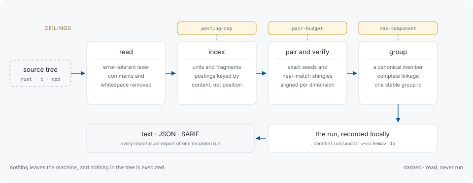
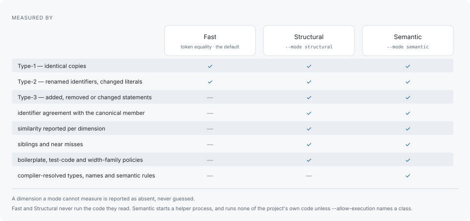

# codehelion

[](https://github.com/libraz/codehelion/actions)
[](https://crates.io/crates/codehelion)
[](https://codecov.io/gh/libraz/codehelion)
[](https://github.com/libraz/codehelion/blob/main/LICENSE)
[](https://www.rust-lang.org)
[](https://github.com/libraz/codehelion)
[](docs/en/introduction.md)

Find duplicated logic in Rust, C and C++ — and keep finding the same duplication
across scans.

codehelion reads sources directly: no build, no compilation database, no
network. It detects identical, renamed and gapped copies, judges each one on
several measures it reports side by side, and names every finding by a
content-derived identifier that survives unrelated edits — so duplication you
have already ruled on stays ruled on, and a scan months later can be measured
against the one before it.

Everything runs on the machine you start it on. Sources and results are never
sent anywhere, the tool has no network dependency, and it does not execute the
code it reads unless you pass a flag that permits a specific class of execution.

codehelion is pre-1.0. The command-line surface, the report formats and the
on-disk database layout can change between releases.

## What a report looks like

Structural mode, run against codehelion's own tree, showing the first two
groups:

```text
codehelion scan · structural mode · ~/src/codehelion

 #1  0.56  type-1 ×2      109 tokens  b92c1297
     ├─ ◆ corpus/synthetic/rust/seed.rs:30-49                   values_equal
     └─   corpus/synthetic/rust/type1.rs:35-54                  values_equal

 #2  0.53  type-1 run ×2  101 tokens  5d7e5cd2
     ├─ ◆ crates/codehelion-cli/src/scan/structural.rs:177-183  run_with
     └─   crates/codehelion-cli/src/scan.rs:62-68               run

... and 1184 more groups (--limit 0 lists every one)

seams: frontend-c-cpp 12 asymmetric changes, 7 breaches (last 6e014d86), 394 findings
       readme-en-ja 1 asymmetric change, 1 breach (last 634aa5c9)
       artifact-fixture-scripts 3 asymmetric changes, 1 breach (last 6f5d63c3)
since seam run 4: frontend-c-cpp -1,159 findings

1,538 groups (type-1 78, type-2 198, type-3 1262) · 352 suppressed · sorted by priority
supplemental: 492 siblings (--show-siblings; 60 dropped by search ceilings), 1,000 near misses (--show-near-misses; 5,633 dropped by the retention cap)
553 files, 199,546 lines, 1,042,197 tokens · run 9 (0 file(s) changed; replay: codehelion report --run 9)
◆ the occurrence a group is measured against · "run" a repeated stretch of statements, not a whole unit · ×N the number of occurrences
open one: codehelion explain b92c1297 · list every group: --limit 0
```

Every field, and what `-v` and `-vv` add:
[Reading a report](docs/en/reading-a-report.md).

## How one scan works



Sources are lexed and normalized, indexed by content, paired into candidates,
verified by alignment, and grouped around a canonical member. The run is
recorded into a local SQLite database, and the text, JSON and SARIF reports are
exports of that record. Every resource ceiling that fires is counted in the
report, so a run that could not finish the search says what it left unexamined.



## Highlights

- **Build-free scanning** — an error-tolerant lexer reads Rust, C and C++
  sources directly, so a mixed-language tree is scanned once, on one basis. No
  compiler, build system or `compile_commands.json` is required.
- **Stable finding IDs** — findings are named by content fingerprints, not line
  numbers. The same input always produces the same identifiers and the same
  group order, which is what makes suppressions and baselines hold across
  refactors.
- **Evidence, not a single score** — a gapped clone reports lexical,
  structural, control-flow, type and API similarity separately, and clone
  confidence, maintenance risk and refactoring difficulty side by side. A
  dimension the mode cannot measure is reported as absent rather than guessed.
- **Visible limits** — every resource ceiling that fires (file size, parse
  timeout, candidate budget) is counted in the report.
- **Local by construction** — the ban on network access and on executing the
  scanned tree is enforced by lints and dependency policy, not by convention:
  `clippy.toml` disallows process spawning and sockets in the scan path, and
  `cargo-deny` refuses the common HTTP stacks outright.

## Install

Every [release](https://github.com/libraz/codehelion/releases) attaches a
prebuilt binary, so nothing has to be compiled to try it. The archive holds one
self-contained executable named `codehelion`; SQLite is bundled.

| platform | archive |
|---|---|
| Linux x86-64 | `codehelion-<version>-linux-x86_64.tar.gz` |
| Linux ARM64 | `codehelion-<version>-linux-aarch64.tar.gz` |
| macOS Apple silicon | `codehelion-<version>-macos-aarch64.tar.gz` |
| Windows x86-64 | `codehelion-<version>-windows-x86_64.zip` |

`SHA256SUMS` is attached beside them. With a Rust toolchain, `cargo install`
builds the same binary from source instead:

```sh
cargo install codehelion
```

That route requires Rust 1.98 or newer, the optional Rust semantic helper
included.

```sh
codehelion scan --mode structural     # read the tree, report the duplication
codehelion explain b92c1297           # open one group
codehelion report --format json --output report.json
```

Semantic mode additionally needs a helper per language. Prebuilt helper archives
(`codehelion-helpers-<version>-...`) are attached for Linux x86-64, macOS Apple
silicon and Windows x86-64; elsewhere, `cargo install codehelion-backend-rust`
and `codehelion-backend-clang` build them. `codehelion doctor` reports what this
machine has. Full setup: [Getting started](docs/en/getting-started.md).

## In CI

`scan --fail-on-findings` against a baseline exits `3` when duplication arrives
that the baseline does not already carry — a gate on what a change added, not on
a percentage that raising the number would answer. `guard --deny-asymmetric`
exits `3` when a change touched part of a seam and not the rest. `--format
sarif` uploads into a code-scanning view.
[Continuous integration](docs/en/continuous-integration.md) has all three.

## Documentation

Start here: [Introduction](docs/en/introduction.md),
[Getting started](docs/en/getting-started.md),
[Analysis modes](docs/en/analysis-modes.md).

Reading the output: [Reading a report](docs/en/reading-a-report.md),
[Clone types](docs/en/clone-types.md), [Grouping](docs/en/grouping.md),
[Stable identifiers](docs/en/stable-ids.md), [Glossary](docs/en/glossary.md).

Using it on a project: [The refactoring loop](docs/en/refactoring-workflow.md),
[Baselines](docs/en/baselines.md), [Suppression](docs/en/suppression.md),
[Configuration](docs/en/configuration.md),
[Seam tracking](docs/en/seam-tracking.md),
[Continuous integration](docs/en/continuous-integration.md),
[The command line](docs/en/cli.md).

Artifacts: [Artifact analysis](docs/en/artifact-analysis.md),
[Calibration](docs/en/calibration.md).

Before you rely on it: [Limitations](docs/en/limitations.md),
[Accuracy](docs/en/accuracy.md),
[Local execution and trust](docs/en/security.md),
[Architecture](docs/en/architecture.md).

## What it does not claim

A finding measures maintainability, not size: it names code a reader has to keep
in step, not bytes a compiler emits. Optimisers fold identical code that is still
duplicated in the source, and the compressed size of an artifact moves far less
than its uncompressed size does.
[`codehelion artifact analyze`](docs/en/artifact-analysis.md) measures that side
separately. codehelion is not a mirror-consistency checker either: it reports the
duplication it finds without claiming to have found every copy. The whole list is
in [Limitations](docs/en/limitations.md).

What is measured, over eight labelled snapshots of real projects: nothing false
reaches the first ten findings (p@10 1.0000, MAP 0.9290) under the default
priority ordering. Read end to end instead, the same verdicts give 0.5920 — the
tail is close to half noise, which is why the report is ordered rather than
merely listed. Both figures, their corpora and how to reproduce them are in
[Accuracy](docs/en/accuracy.md).

## Development

```sh
make format        # auto-fix: clippy --fix + cargo fmt
make check         # format-check + lint + boundary checks + test + doc
make eval          # detection accuracy over the corpora
```

`make help` lists the rest. Guardrails: `rustfmt` with a pinned config, `clippy`
`pedantic` + `nursery` with warnings as errors, `unsafe` forbidden, `cargo-deny`
over advisories, bans and licences, and two boundary checks that fail if the
clone engine gains a dependency on the artifact reader or a compiler API reaches
the CLI. Tests are written alongside the code they cover.

## Contributing

See [CONTRIBUTING.md](CONTRIBUTING.md). To report a security issue, follow
[SECURITY.md](SECURITY.md) rather than opening a public issue.

## License

Licensed under the [Apache License, Version 2.0](LICENSE).
