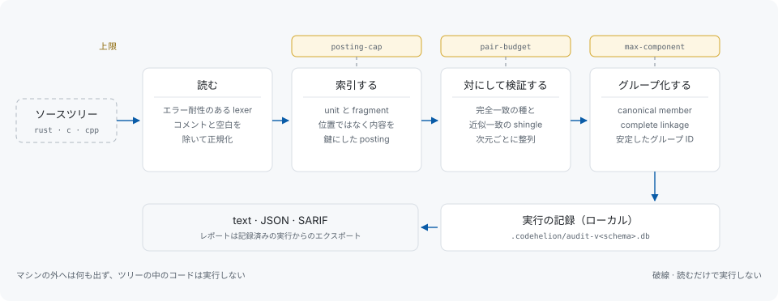
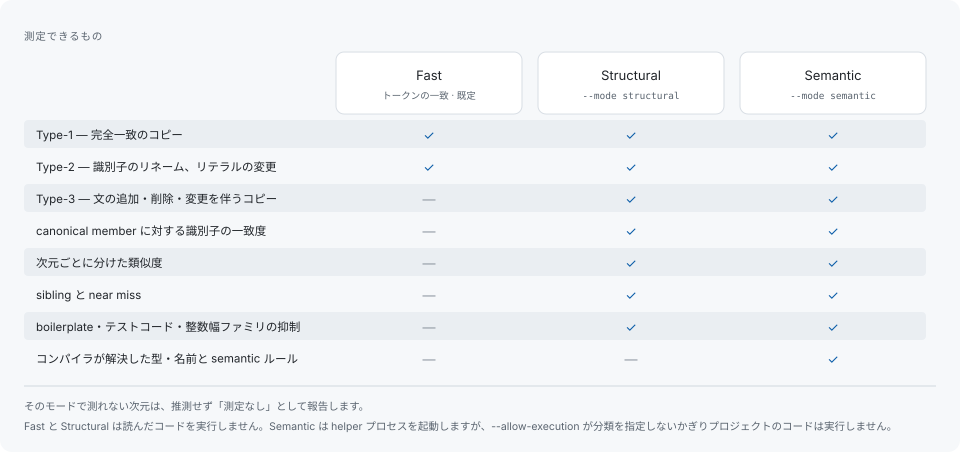

# codehelion

[](https://github.com/libraz/codehelion/actions)
[](https://crates.io/crates/codehelion)
[](https://codecov.io/gh/libraz/codehelion)
[](https://github.com/libraz/codehelion/blob/main/LICENSE)
[](https://www.rust-lang.org)
[](https://github.com/libraz/codehelion)
[](docs/ja/introduction.md)

Rust / C / C++ の重複ロジックを検出し、スキャンをまたいで同じ重複を追い続けるツールです。

codehelion はソースを直接読みます。ビルドも compilation database もネットワークも要りません。完全一致・リネーム・欠落を伴うコピーを検出し、判定に使った複数の指標を並べて報告し、各 finding には無関係な編集では変わらない内容由来の識別子を付けます。一度判断した重複は判断済みのまま残り、数か月後のスキャンを前回のスキャンと突き合わせられます。

処理はすべて実行したマシンの中で完結します。ソースコードも解析結果も外部に送信せず、ネットワークへの依存を持たず、実行分類ごとの許可フラグを渡さないかぎり読み取ったコードを実行しません。

codehelion は 1.0 前です。コマンドラインの形・レポート形式・データベースのレイアウトはリリース間で変わり得ます。

## レポートの見え方

codehelion 自身のツリーに対する Structural モードの実行結果です（先頭 2 グループ）。

```text
codehelion scan · structural mode · ~/src/codehelion

 #1  0.56  type-1 ×2      109 tokens  b92c1297
     ├─ ◆ corpus/synthetic/rust/seed.rs:30-49                   values_equal
     └─   corpus/synthetic/rust/type1.rs:35-54                  values_equal

 #2  0.53  type-1 run ×2  101 tokens  5d7e5cd2
     ├─ ◆ crates/codehelion-cli/src/scan/structural.rs:205-211  run_with
     └─   crates/codehelion-cli/src/scan.rs:70-76               run

... and 1185 more groups (--limit 0 lists every one)

1,539 groups (type-1 78, type-2 199, type-3 1262) · 352 suppressed · sorted by priority
552 files, 199,199 lines, 1,040,264 tokens · run 6 (209 file(s) changed; replay: codehelion report --run 6)
◆ the occurrence a group is measured against · "run" a repeated stretch of statements, not a whole unit · ×N the number of occurrences
open one: codehelion explain b92c1297 · list every group: --limit 0
```

各フィールドの意味と、`-v` / `-vv` が追加するものは[レポートの読み方](docs/ja/reading-a-report.md)にあります。

## 1 回のスキャンの流れ



ソースを lexer が読んで正規化し、内容で索引し、候補ペアを作り、アラインメントで検証し、canonical member を基準にグループ化します。実行結果はローカルの SQLite に記録され、text・JSON・SARIF のレポートはその記録からのエクスポートです。発火したリソース上限はすべてレポートに計上されるため、探索を完了できなかった実行は何を未検査のまま残したかを述べます。



## 特長

- **ビルド不要のスキャン** — エラー耐性のある lexer が Rust / C / C++ のソースを直接読むため、言語が混在するツリーも一度に、同じ基準で走査できます。コンパイラ・ビルドシステム・`compile_commands.json` はいずれも不要です。
- **安定した finding ID** — finding は行番号ではなく内容の fingerprint で名前を持ちます。同じ入力からは常に同じ識別子と同じグループ順序が得られ、これが抑制設定と baseline をリファクタリングをまたいで持続させます。
- **単一スコアではなく根拠** — 欠落を伴うクローンは lexical / structural / control-flow / type / API の similarity を個別に報告し、clone confidence・maintenance risk・refactoring difficulty を並べて示します。そのモードで測れない次元は推測せず、測定なしとして報告します。
- **見える上限** — 発火したリソース上限（ファイルサイズ・parse timeout・候補 budget）はすべてレポートに計上されます。
- **構造としてのローカル実行** — ネットワークアクセスの禁止と対象ツリーを実行しない方針は、運用上の約束ではなく lint と依存ポリシーで強制しています。`clippy.toml` が scan path でのプロセス起動とソケットを禁止し、`cargo-deny` が主要な HTTP スタックを依存グラフごと拒否します。

## インストール

```sh
cargo install codehelion
```

生成されるのは `codehelion` という自己完結の単一バイナリで、SQLite は同梱されています。任意の Rust Semantic helper を含め、すべて Rust 1.98 以降が必要です。

```sh
codehelion scan --mode structural     # ツリーを読み、重複を報告する
codehelion explain b92c1297           # グループを 1 つ開く
codehelion report --format json --output report.json
```

Semantic モードでは、解析したい言語ごとの helper も必要です（`cargo install codehelion-backend-rust`、`codehelion-backend-clang`）。このマシンに何があるかは `codehelion doctor` が報告します。導入手順は[はじめかた](docs/ja/getting-started.md)にあります。

## ドキュメント

まずここから: [はじめに](docs/ja/introduction.md)、[はじめかた](docs/ja/getting-started.md)、[解析モード](docs/ja/analysis-modes.md)。

出力を読む: [レポートの読み方](docs/ja/reading-a-report.md)、[クローンの型](docs/ja/clone-types.md)、[グループ化](docs/ja/grouping.md)、[安定した識別子](docs/ja/stable-ids.md)、[用語集](docs/ja/glossary.md)。

プロジェクトで使う: [リファクタのループ](docs/ja/refactoring-workflow.md)、[baseline](docs/ja/baselines.md)、[抑制](docs/ja/suppression.md)、[設定](docs/ja/configuration.md)、[seam の追跡](docs/ja/seam-tracking.md)、[コマンドライン](docs/ja/cli.md)。

成果物: [成果物解析](docs/ja/artifact-analysis.md)、[calibration](docs/ja/calibration.md)。

頼る前に読むもの: [制限](docs/ja/limitations.md)、[精度](docs/ja/accuracy.md)、[ローカル実行と信頼](docs/ja/security.md)、[アーキテクチャ](docs/ja/architecture.md)。

## 主張しないこと

finding が測るのは保守性であってサイズではありません。示すのは読み手が同期を取り続ける必要のあるコードであり、コンパイラが出力するバイト数ではありません。最適化器はソース上で重複したままのコードを畳みますし、成果物の圧縮後のサイズは非圧縮のサイズほどには動きません。そちらは [`codehelion artifact analyze`](docs/ja/artifact-analysis.md) が別に測ります。codehelion はミラー整合性検査ツールでもありません。見つけた重複を報告するだけで、すべてのコピーを見つけたとは主張しません。全体は[制限](docs/ja/limitations.md)に、実測した適合率と再現率は[精度](docs/ja/accuracy.md)にあります。

## 開発

```sh
make format        # 自動修正: clippy --fix + cargo fmt
make check         # format-check + lint + 境界検査 + test + doc
make eval          # コーパスに対する検出精度
```

残りは `make help` にあります。ガードレールは、設定を固定した `rustfmt`、`pedantic` + `nursery` を警告エラー扱いにした `clippy`（`unsafe` は禁止）、依存関係の advisory・ban・license を確認する `cargo-deny`、そしてクローンエンジンが成果物リーダーに依存したり compiler API が CLI に届いたりすると落ちる 2 つの境界検査です。テストは対象コードと同時に書きます。

## 貢献

[CONTRIBUTING.md](CONTRIBUTING.md) を参照してください。セキュリティ上の問題は公開 issue ではなく [SECURITY.md](SECURITY.md) の手順で報告してください。

## ライセンス

[Apache License, Version 2.0](LICENSE) で提供します。
