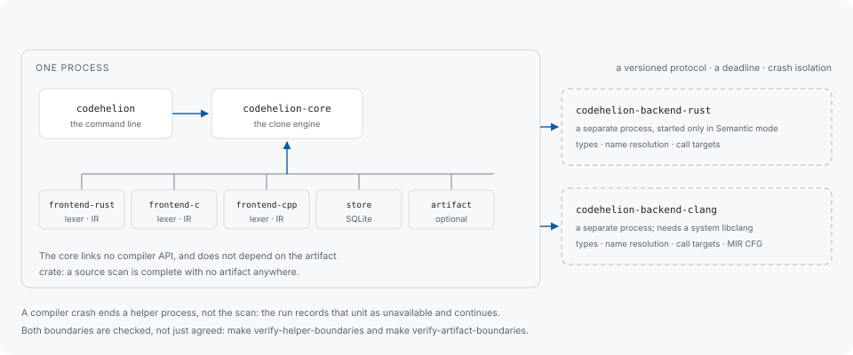

# Architecture



## Crates

The workspace is a set of `codehelion-*` crates with one fixed dependency
direction: the CLI depends on the core engine, and the frontends, the store and
the artifact reader are what the core is used with.

| Crate | What it holds |
|---|---|
| `codehelion` | the command line, the report renderers, the scan driver |
| `codehelion-core` | the clone engine: normalization, indexing, pairing, verification, grouping, priority |
| `codehelion-frontend-rust` / `-c` / `-cpp` | the error-tolerant lexers and the IR each language produces |
| `codehelion-store` | the local SQLite schema and every read and write against it |
| `codehelion-artifact` | the compiled-artifact readers, one per format behind its own feature |
| `codehelion-helper` / `-helper-protocol` | locating helper programs, and the wire types shared with them |
| `codehelion-backend-rust` / `-backend-clang` | the helper binaries themselves |

## Two boundaries that are checked rather than agreed

**The clone engine does not depend on the artifact reader.** Artifact analysis is
optional in the strongest sense available: a source scan is complete with no
artifact anywhere, and the crate graph is what makes that true rather than a
convention about which functions to call.

**Compiler APIs are never linked into the CLI.** Compiler evidence arrives from a
separate process, so a compiler's own dependencies, version floor and crash
behaviour stay out of the binary a user installs.

Neither is a promise in prose:

```sh
make verify-artifact-boundaries
make verify-helper-boundaries
```

Both run in `make check` and in CI. Moving either boundary fails them.

## The helper protocol

A helper is an independent binary reached over a versioned protocol. The exchange
negotiates capabilities — what the helper can supply, what execution it will
perform if permitted — under a response deadline, and the helper's process
isolates its failures: a compiler crash ends the helper, and the scan records that
unit as unavailable and continues.

`codehelion doctor` prints what each installed helper answered: its version, the
protocol it speaks, the compiler it found, what it supplies, and what it runs when
permitted.

The handshake cases live in `crates/codehelion-helper-conformance/`. They run the
independently built helper binaries, rather than checking the protocol against a
description of it that the CLI also generated.

## Storage

Local SQLite is the primary storage; JSON, SARIF and CSV are export formats and
never a read-back path. That direction is deliberate: a report is a rendering of
a recorded run, so adding a format cannot change what a scan concluded, and no
consumer's parser becomes part of the tool's own state.

The schema carries a version. A database written under a different one is not
migrated — see [Configuration](configuration.md#the-local-database).

## Versioned schemas

Each IR, fingerprint and normalization rule carries a version that includes the
normalization, frontend, mode, language and build variant it belongs to. Two runs
read under different conditions are therefore kept apart rather than compared, and
a report always states the conditions it was produced under.

## Contributing

See
[CONTRIBUTING.md](https://github.com/libraz/codehelion/blob/main/CONTRIBUTING.md).
The short version of the local workflow:

```sh
make format        # auto-fix: clippy --fix + cargo fmt
make check         # format-check + lint + boundary checks + test + doc
make eval          # detection accuracy over the corpora
```

`unsafe` is forbidden, clippy runs with `pedantic` and `nursery` as errors, and
tests are written alongside the code they cover.
