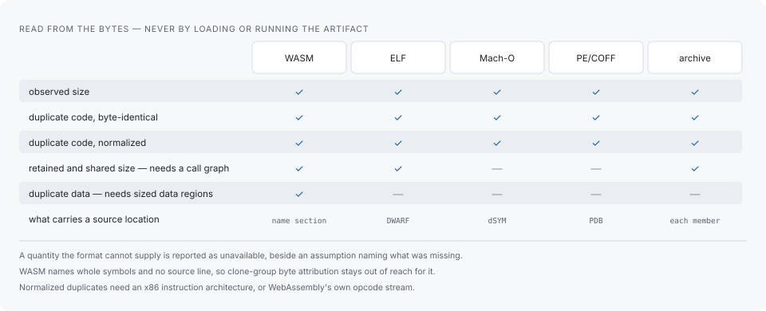

# Artifact analysis

The `artifact` commands read a compiled artifact locally. They parse bytes; they
never load or execute the inspected artifact. Source scanning does not depend on
any of it — the clone engine has no dependency on the artifact reader, and a
source scan is complete with no artifact anywhere.

```sh
codehelion artifact analyze path/to/binary
codehelion artifact analyze path/to/binary --format csv  # also json, or text by default
codehelion artifact report              # render the latest saved analysis
codehelion artifact compare before/binary after/binary
```

## What each format can establish



Observed size and duplicate code are reported for every format. The rest is what
the format itself can establish: retained and shared size need a call graph,
which is derived for WASM, ELF and static archives; duplicate data needs
independently sized data regions, which WASM has; a source location needs debug
evidence — DWARF for ELF, a matching dSYM for Mach-O, a matching PDB for PE/COFF,
a recorded source-map URL for WASM.

A quantity the format cannot supply is reported as unavailable beside an
assumption naming what was missing, rather than as a number.

The per-format capability table is generated from the definitions the backends
themselves return, in `crates/codehelion-artifact/FORMAT_SUPPORT.md`.

### WebAssembly correlates one symbol at a time

ELF, Mach-O and PE/COFF reach a source line through DWARF, a matching dSYM or a
matching PDB, and a source line is what lets a clone group's line range be
attributed bytes. A core module carries function names in its name section and no
line information, so correlation names whole functions and leaves clone-group
byte attribution unavailable. Building the module with DWARF would change the size
being measured, which is usually the reason to inspect it, so the reports say what
the name section can and cannot support instead of asking for a build that answers
a different question.

## Debug companions

A companion is accepted only after the matching ELF build ID, Mach-O UUID or PE
CodeView/PDB identity has been verified — an unverified companion would attribute
bytes from one build to the source of another.

```sh
codehelion artifact analyze path/to/binary --debug-file companion
```

That works without a source scan. Add `--source-run` and `--build-variant` only
when requesting source-artifact correlation.

## Build variants

`--build-variant` takes a file you write, not one to go looking for. Its contents
are yours to choose; what they buy is that only artifacts built the same way are
compared with one another:

```sh
echo '{"profile":"release","target":"wasm32","toolchain":"emcc-5.0.2"}' > build-variant.json
codehelion artifact analyze dist/app.wasm --build-variant build-variant.json --source-run 2
```

When an artifact command receives `--build-variant manifest.json`, its identity
uses the canonical JSON value, so whitespace and object-member ordering do not
change the build variant.

A source run also has a build variant, and reports print its digest. The two are
separate conditions — how the sources were read, and how the artifact was built —
recorded side by side rather than checked against each other. There is
no source digest to find and copy into the manifest.

## Instantiation multiplicity

How many copies exist in the source and how many bodies exist in the binary are
different axes, and only the first is in codehelion's search model. One source
template can become a dozen distinct instantiations in the artifact, because the
closure or type at each call site differs. There is one copy to find in the
source, so no clone group describes that multiplicity.

Correlating a source run reports it separately:

```sh
codehelion artifact analyze path/to/binary --source-run 1 --build-variant build-variant.json
```

lists the source units the artifact emitted as more than one body, with how many
bodies and their observed size. Those bytes are what the artifact spends today and
not a saving — consolidating the one source copy removes none of the bodies, and
shrinking that figure means emitting fewer of them. The count needs only that a
mapping named a single source unit, so symbol names are enough for it and debug
line information is not required.

## Comparing two builds

```sh
codehelion artifact compare before/binary after/binary
```

reports the measured byte delta between two artifacts of the same format. Given
both build-variant manifests, it warns when the build conditions differ rather
than presenting a difference as if it came from a source change alone. Given a
source run and a clone group as well, it also records a calibration measurement —
see [Calibration](calibration.md).

## Limits and isolation

`artifact analyze` and `artifact compare` reject inputs above 512 MiB by default
and run parsing, correlation, persistence and rendering in a separate worker
process with one 30-second deadline. The worker is a separate process, so the
deadline remains enforceable when a malformed input makes a parser stop making
progress, and timeout diagnostics name the phase that was running.

- `--max-bytes` and `--timeout-seconds` adjust the input and time ceilings.
- `--max-memory-bytes <bytes>` enforces a worker virtual-memory ceiling on Linux;
  other platforms reject the option rather than silently ignoring it.
- `--untrusted` clamps all three at once, so it is available on Linux only:
  elsewhere it fails rather than accept an artifact nobody vouches for under a
  memory ceiling that cannot be enforced.

`artifact report` and `artifact calibration` re-read what is already in the local
database and run in process, so none of these options apply to them. The versioned
IR retained for `artifact report` is separately capped at 64 MiB, and an analysis
whose persisted details exceed that limit fails without writing a partial database
record.

## Reading the result

What these commands measure is the artifact as it was built. They do not forecast
what consolidating duplication in the source would take out of it, and the gap
between the two is wide enough to matter — see [Limitations](limitations.md)
before using a size figure to justify a refactor.
