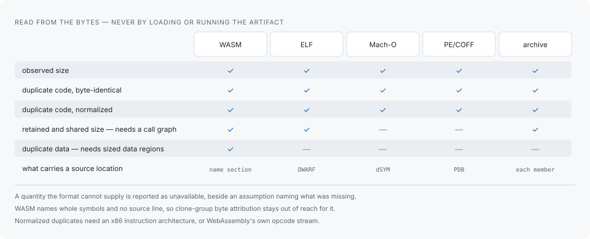

# Artifact analysis

The `artifact` commands read a compiled artifact locally. They parse bytes; they
never load or execute the inspected artifact. Source scanning does not depend on
any of it — the clone engine has no dependency on the artifact reader, and a
source scan is complete with no artifact anywhere.

```sh
codehelion artifact analyze path/to/binary
codehelion artifact analyze path/to/binary --format csv  # also json, or text by default
codehelion artifact report              # render the latest saved analysis
codehelion artifact compare before/binary after/binary
```

## What each format can establish



Observed size and duplicate code are reported for every format. The rest is what
the format itself can establish: retained and shared size need a call graph,
which is derived for WASM, ELF and static archives; duplicate data needs
independently sized data regions, which WASM has; a source location needs debug
evidence — DWARF for ELF, a matching dSYM for Mach-O, a matching PDB for PE/COFF,
a recorded source-map URL for WASM.

A quantity the format cannot supply is reported as unavailable beside an
assumption naming what was missing, rather than as a number.

Static archives and relocatable objects attribute whole symbols only, with no
source line range: a relocatable object has no load address for a line table to
join. Linking the members into an image is what reaches a line range.

For ELF, retained sizes and dead-code candidates follow direct calls, jumps that
leave a function (tail calls) and functions whose address is taken, since those
run with no call edge reaching them. A jump or call through a register or a
memory slot reaches a callee the reader cannot name, so where one occurs the
dead-code list is a list of candidates and not a proof.

The per-format capability table is generated from the definitions the backends
themselves return, in `crates/codehelion-artifact/FORMAT_SUPPORT.md`.

### WebAssembly correlates one symbol at a time

ELF, Mach-O and PE/COFF reach a source line through DWARF, a matching dSYM or a
matching PDB, and a source line is what lets a clone group's line range be
attributed bytes. A core module carries function names in its name section and no
line information, so correlation names whole functions and leaves clone-group
byte attribution unavailable. Building the module with DWARF would change the size
being measured, which is usually the reason to inspect it, so the reports say what
the name section can and cannot support instead of asking for a build that answers
a different question.

## Debug companions

A companion is accepted only after the matching ELF build ID, Mach-O UUID or PE
CodeView/PDB identity has been verified — an unverified companion would attribute
bytes from one build to the source of another.

```sh
codehelion artifact analyze path/to/binary --debug-file companion
```

That works without a source scan. Add `--source-run` and `--build-variant` only
when requesting source-artifact correlation.

## Build variants

`--build-variant` takes a file you write, not one to go looking for. Its contents
are yours to choose; what they buy is that only artifacts built the same way are
compared with one another:

```sh
echo '{"profile":"release","target":"wasm32","toolchain":"emcc-5.0.2"}' > build-variant.json
codehelion artifact analyze dist/app.wasm --build-variant build-variant.json --source-run 2
```

When an artifact command receives `--build-variant manifest.json`, its identity
uses the canonical JSON value, so whitespace and object-member ordering do not
change the build variant.

A source run also has a build variant, and the JSON and SARIF reports carry its
digest; the text report prints it only beside an artifact savings estimate. The two are
separate conditions — how the sources were read, and how the artifact was built —
recorded side by side rather than checked against each other. There is
no source digest to find and copy into the manifest.

## Instantiation multiplicity

How many copies exist in the source and how many bodies exist in the binary are
different axes, and only the first is in codehelion's search model. One source
template can become a dozen distinct instantiations in the artifact, because the
closure or type at each call site differs. There is one copy to find in the
source, so no clone group describes that multiplicity.

Correlating a source run reports it separately:

```sh
codehelion artifact analyze path/to/binary --source-run 1 --build-variant build-variant.json
```

lists the source units the artifact emitted as more than one body, with how many
bodies and their observed size. Those bytes are what the artifact spends today and
not a saving — consolidating the one source copy removes none of the bodies, and
shrinking that figure means emitting fewer of them. The count needs only that a
mapping named a single source unit, so symbol names are enough for it and debug
line information is not required.

## Who owns the code

> **Pre-1.0 surface.** This is documented and tested, but has not had the real
> use that would make it worth a promise, so it can change between releases.

`artifact analyze` splits the code bytes of the symbols it reports by owner, and
names the non-toolchain functions that keep toolchain code in the artifact. Both
read symbol names only, so they apply to every format and language once a name
exists; the holder view also needs the call graph and retained sizes (see
[What each format can establish](#what-each-format-can-establish)).

The **owner** of a symbol is the first element of its defining path: a Rust
crate, a top-level C++ namespace, or `<global>` for an unqualified name. Each
owner falls into one class:

- `toolchain` — the Rust sysroot crates, C++ `std` and the global allocation
  operators, C17 Annex B functions, identifiers C17 reserves for the
  implementation, and runtime support.
- `own` — an owner listed in `[artifact] own`, see
  [Configuration](configuration.md#artifact).
- `other` — a named owner that is neither, such as a third-party crate.
- `unnamed` — a function without a name, which no owner can be assigned to.

Toolchain classification never depends on the declaration. With `own` empty,
named code outside the toolchain is reported as `other`, and the report says so.

For a C function `parse` that returns `strtof(s, 0)`, built with emscripten at
`-O1` and analysed with `own = ["<global>"]`:

```
ownership: own 6768 bytes (5 symbols), toolchain 10629 bytes (35 symbols), other 0 bytes (0 symbols), unnamed 0 bytes (0 symbols)
  declared own: <global>
  reserved (toolchain, reserved): 9013 bytes, 25 symbols
  <global> (own): 6768 bytes, 5 symbols
  c-std (toolchain, c_std): 1540 bytes, 6 symbols
  runtime (toolchain, runtime): 76 bytes, 4 symbols
  outside symbols: 61 bytes
  assumption: ownership follows the defining path of each symbol name, so generic code instantiated for your types is counted under the library that defines it
toolchain holders (held bytes are part of the holder's retained size):
  parse (own) f31665862c71112cfffda8f55fc54dd2: 17307 bytes in 34 symbols, 6756 bytes in 4 symbols absorbed
    head strtof 320251c57384d307522b489a48cc4e39: 17307 bytes
  shared: 78 bytes in 5 symbols, 0 bytes in 0 symbols absorbed
    setThrew ba286dbdc84dc40e5966ae8f29485879: 38 bytes (root), called by nothing
    _initialize 4feb66b59715a8dcbf2af30ae02ec5d6: 20 bytes (root), called by nothing
    _emscripten_stack_restore ef2222560055353cb931a59336cb3e00: 10 bytes (root), called by nothing
    emscripten_stack_get_current 4eaae22504bd0bae04ab33f12aeef742: 8 bytes (root), called by nothing
    __wasm_call_ctors a0d352ddbe45c0d90cb9d358e3fa1f9d: 2 bytes (root), called by _initialize (toolchain)
  assumption: unqualified functions whose immediate dominator is toolchain code are counted as toolchain code, except main and static initializers
  assumption: toolchain holders treat every recorded function reference as a root, so code reached through a function table is reported as shared
```

`outside symbols` is the executable section's size minus the symbols' sizes, so
the figures add up to the section. Text output lists the ten largest owners; the
JSON output carries all of them. `artifact compare` splits the byte delta the
same way, attributing a symbol to its owner in the after build (in the before
build when it was removed) and stating the remainder as `outside symbols`.

A **holder** is a function that is not toolchain code but keeps toolchain code in
the artifact: the toolchain code is reachable only through it. Each toolchain
function is attributed to its nearest non-toolchain dominator in the call graph.
The toolchain functions entered directly below a holder are its **heads**, and the
holder's line gives the bytes held by everything under them. An unqualified
function whose immediate dominator is toolchain code is counted as toolchain code,
so a libc helper does not appear to hold the libc code it calls; these bytes are
reported separately as absorbed. `main` and static initializers are never
absorbed.

Held bytes are part of the holder's retained size. They show where toolchain code
enters and what dropping the entry would unlink, not a guaranteed reduction: the
same code may be reached again by another route in the next build.

Toolchain code that no single non-toolchain function dominates is **shared
toolchain code**. It is totalled, and each entry lists the functions that call it
directly, or `(root)` when the artifact exports it. Shared bytes belong to no
holder and are not split among the callers. Holders are unavailable whenever
retained sizes are, and the report says so instead of giving a figure. The limits of
name-based ownership are in
[Limitations](limitations.md#artifact-inspection-depends-on-symbols).

Owner labels are derived each time a report is rendered, from the stored symbol
names and the current `[artifact] own`; nothing about ownership is written to the
database. `artifact report` therefore follows the configuration as it is when you
run it, and `artifact compare` reads the configuration in the working directory
the same way `artifact analyze` does.

## Copies of one function

Several functions of one artifact can share a name and a body, as identical libc
functions do in a statically linked build. Each copy keeps its own fingerprint, so
each has its own size and place in the call graph. The shared content is named by
`content_fingerprint` in the JSON report. A copy that no caller, callee, root,
size or body can tell from another is told apart by file order and is marked
`identity_by_order`. `artifact compare` pairs copies by content rather than by
fingerprint. Archive symbols also keep a `content_fingerprint` independent of the
member bytes, so changing one function does not change the comparison identity of
other functions in the same member.

## Comparing two builds

> **Pre-1.0 surface.** This is documented and tested, but has not had the real
> use that would make it worth a promise, so it can change between releases.

```sh
codehelion artifact compare before/binary after/binary
```

reports the measured byte delta between two artifacts of the same format. Given
both build-variant manifests, it warns when the build conditions differ rather
than presenting a difference as if it came from a source change alone. A native
symbol whose bytes changed while its size did not is reported as modified, with
the retained code bytes standing in for a body identity where the backend decodes
none. Given a
source run and a clone group as well, it also records a calibration measurement —
see [Calibration](calibration.md).

## Limits and isolation

`artifact analyze` and `artifact compare` reject inputs above 512 MiB by default
and run parsing, correlation, persistence and rendering in a separate worker
process with one 30-second deadline. The worker is a separate process, so the
deadline remains enforceable when a malformed input makes a parser stop making
progress, and timeout diagnostics name the phase that was running.

- `--max-bytes` and `--timeout-seconds` adjust the input and time ceilings. The
  input ceiling also bounds how far DWARF and PDB debug information is expanded
  into frames and line records.
- `--max-memory-bytes <bytes>` enforces a worker virtual-memory ceiling on Linux;
  other platforms reject the option rather than silently ignoring it.
- `--untrusted` clamps all three at once, so it is available on Linux only:
  elsewhere it fails rather than accept an artifact nobody vouches for under a
  memory ceiling that cannot be enforced.

`artifact report` and `artifact calibration` re-read what is already in the local
database and run in process, so none of these options apply to them. The versioned
IR retained for `artifact report` is separately capped at 64 MiB, and an analysis
whose persisted details exceed that limit fails without writing a partial database
record.

## Reading the result

What these commands measure is the artifact as it was built. They do not forecast
what consolidating duplication in the source would take out of it, and the gap
between the two is wide enough to matter — see [Limitations](limitations.md)
before using a size figure to justify a refactor.
