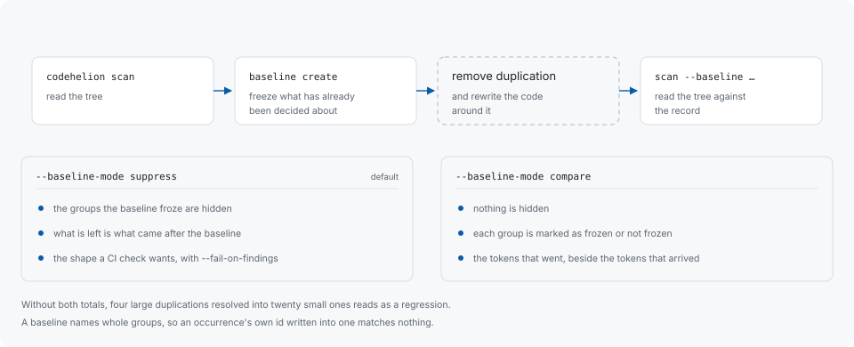

# Baselines

> **Pre-1.0 surface.** This is documented and tested, but has not had the real
> use that would make it worth a promise, so it can change between releases.

A baseline is the explicit record of the findings a project has accepted. It is a
file you commit, and later scans read it to say what came after it.



## Creating one

```sh
codehelion scan                       # read the tree
codehelion baseline create .          # record where you are starting from
```

`baseline create` freezes the last recorded scan's reported findings into
`codehelion-baseline.json` (`--file` names another path). `baseline update` drops
the entries the latest scan no longer reports, which is how a baseline shrinks as
duplication is actually removed.

A baseline names whole groups, so an occurrence's own id written into one matches
nothing. See [Stable identifiers](stable-ids.md).

## Reading a scan against one

```sh
codehelion scan --baseline codehelion-baseline.json
```

The default mode is `suppress`: the groups the baseline froze are hidden, and what
is left is what came after the baseline. Combined with `--fail-on-findings`, that
is the shape a CI check wants — the build fails when duplication arrives that
nobody has ruled on.

```sh
codehelion scan --baseline codehelion-baseline.json --baseline-mode compare
```

`compare` hides nothing. It reports each group as one the baseline froze or one it
did not, and puts the tokens that went beside the tokens that arrived — without
both, four large duplications resolved into twenty small ones reads as a
regression. Removing a duplication also rewrites the code around it, so the
groups that come out of the rearrangement carry new ids; one standing in the place
an entry has just left is reported as standing there rather than as duplication
somebody added.

If the build variant or the detector versions differ, create a fresh baseline for
the current scan rather than carrying the old one across.

## When you do not need one

A baseline is for freezing a threshold and defending it in CI. Following your
own progress through a refactor does not need one: rescan, and read the summary
line saying what became of the previous run's highest-ranked groups together with
`codehelion explain <id>`, which says whether a group is still in the latest run.
Both are derived from the runs already in the local database, so
nothing has to be created, kept in step, or committed.

## In CI

```sh
codehelion scan --mode structural \
  --baseline codehelion-baseline.json \
  --fail-on-findings
```

Exit code `3` means visible findings remain. Everything else about the run — the
report, the recorded snapshot, the ceilings that fired — is unchanged by the
flag, so the same command is useful to run locally before pushing.

Two things are worth knowing before wiring this up. A baseline is tied to the
conditions the scan was read under, so a CI job that reads the tree differently
than a developer does (a different `.h` grammar decision, a different mode) will
not match the baseline that developer created. And a scan records into a local
database: in CI that database is usually thrown away with the runner, which costs
nothing except the run-to-run comparison the totals would otherwise print.
