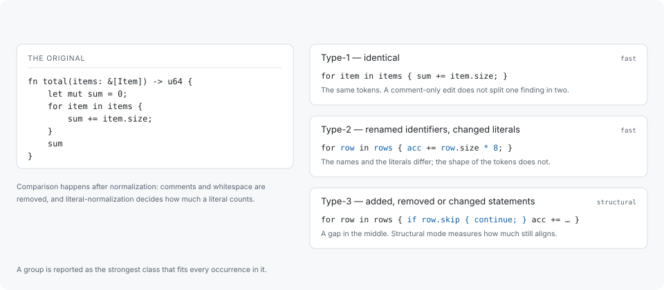

# Clone types

A group is reported as the strongest class that fits every occurrence in it. The
classes are the standard three, measured after normalization.



## Type-1 — identical

The same tokens. Comments and whitespace are removed before comparison, so a
copy that has only been reflowed or commented is still Type-1, and a comment-only
edit does not split one finding into two.

Type-1 is the class a linker is most likely to have already folded, which is why
a Type-1 finding is a maintainability statement rather than a size one. See
[Limitations](limitations.md).

## Type-2 — renamed identifiers, changed literals

The same token shape with different names or different literal values. How much
a literal counts is the one part of this that is configurable:

```toml
# literal-normalization = "full"    # "preserve", "category" or "full"
```

- `preserve` — two occurrences differ if any literal differs.
- `category` — literals of the same kind compare equal.
- `full` — literals are normalized away entirely.

`full` is the default: a table of constants copied twice with different numbers
in it is the same maintenance problem either way.

## Type-3 — added, removed or changed statements

A copy with a gap: a guard inserted in the middle, a case dropped, a statement
rewritten. Fast mode does not reach this class at all — that is the cost of
skipping the structural pass, not a tuning question. Structural mode measures how
much of the two still aligns, and reports the alignment as the similarity
breakdown.

Type-3 is where most of a mature tree's duplication lives, and it is also where
the classes stop being crisp: a copy that has drifted far enough is not a copy
any more, and the gate that decides where that line falls is what
[Grouping](grouping.md) describes.

## What is compared

The unit of comparison is a whole body — a function, a method — and, inside one,
a run of statements. A group therefore either says "these two bodies are copies"
or "this run of statements repeats here", and the report distinguishes them.

The smallest clone reported is set in tokens, not lines:

```toml
# min-clone-tokens = 20             # smallest clone reported, in tokens
```

Below that, a match says more about the language's syntax than about the code.

## Semantic matches

Semantic mode adds registered rules over compiler-resolved names and types —
matches that no token or shape comparison reaches, each asserted by its own tests
rather than by a corpus average. They are a bounded, enumerated set rather than a
general claim about semantic equivalence: `codehelion doctor` reports how many
rules this build has and which of them need `--compare-languages`.
