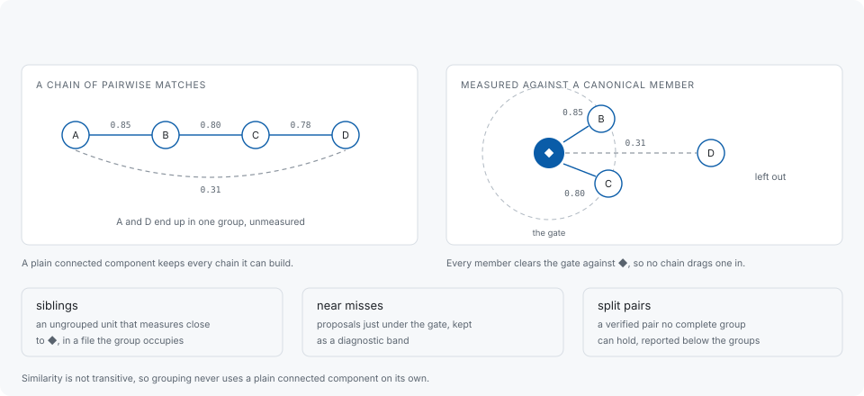

# Grouping

A pair of occurrences that verify against each other is not yet a finding. What
the report lists is a group, and how occurrences become one is the part of the
design that decides whether a report is readable.



## Why not a connected component

Similarity is not transitive. A measures 0.85 against B, B measures 0.80 against
C, C measures 0.78 against D — and A against D measures 0.31. A plain connected
component keeps every chain it can build, so all four end up in one group, and
the two at the ends were never compared with each other at all. A reader who
opens that group finds two unrelated routines in it and stops trusting the next
one.

codehelion measures every candidate against a **canonical member** and admits
only what clears the gate against it, which is complete-linkage behaviour rather
than single-linkage. The canonical member is the occurrence the group is measured
against, marked `◆` in the listing and reported first: it is the one to read.

A group is bounded, too. `limits.max-component` caps the largest set of related
units compared as one piece, so a pathological neighbourhood cannot turn into one
enormous group.

## What the gate leaves out, and where it goes

A gate that admits nothing questionable also discards evidence. Three channels
keep that evidence instead of dropping it, each reported apart from the groups so
neither is mistaken for the other.

### Split pairs

A verified pair that no complete group can hold — because admitting it would
force two units that do not match each other into one group. It is a real
finding, so it is kept:

```toml
# split-pairs = "rank-down"   # "hide", "rank-down" or "report"
```

By default these are visible, below the complete groups.

### Siblings

An ungrouped unit that sits close to a group without joining it. Structural and
Semantic modes run two sibling channels:

- **the similarity channel**, which always runs. It retains an ungrouped unit
  that measures close to a group's canonical member and sits in a file that group
  already occupies.
- **the signature channel**, which is opt-in with `--siblings-by-signature` and
  off by default. Enabled, it can retain a low-confidence sibling whose
  normalized signature matches the group's canonical function when the otherwise
  ungrouped function is in the same directory.

A shared signature is evidence only while it is rare. A signature more units
share than `limits.signature-sibling-max-units-per-signature` allows is left out
of the search entirely, and the summary names how many signatures were left out
and how far the widest one reached. What the channel cannot help with is stated
in [Limitations](limitations.md).

`--show-siblings` only changes text visibility; JSON and SARIF retain sibling
data regardless.

### Near misses

Proposals that landed just under the primary gate, retained as a diagnostic band
whose width and size are configurable:

```toml
# near-miss-delta = 0.05     # the band below the Type-3 gate
# near-miss-cap = 1000       # retained diagnostic near misses per report
```

`--show-near-misses` lists them. They are the answer to "did it nearly match
something?" and are not counted as findings.

## Reading a group's neighbourhood

An intact copy is maintenance debt; a copy that has drifted is a bug today — and
the drifted one is the harder of the two to detect. So when a group is reported,
read what sits beside it: the same-shaped neighbours the group does *not* include
are where a drifted copy is most likely to be. [Limitations](limitations.md)
gives two measured cases where exactly that happened.
