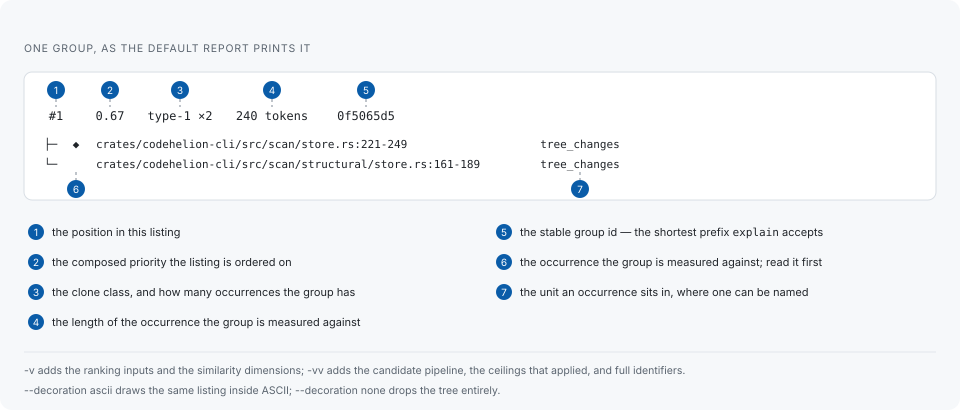

# Reading a report

## One group



The ranking value leads each heading because it is what the listing is in order
on. `◆` marks the occurrence the group is measured against, which is the one to
read first. The identifier that closes the heading is the shortest prefix
`codehelion explain` accepts, so a group can be opened straight from the listing.

A heading sometimes carries an annotation naming another group, as in
`cabfd679 [narrower cut of baf4e127]`. That is a duplication which is a shorter
cut of a longer one: it is reported so nothing is hidden, and it takes no place
of its own in the ordering.

## What the totals say

```text
1,539 groups (type-1 78, type-2 199, type-3 1262) · 352 suppressed · sorted by priority
supplemental: 493 siblings (--show-siblings; 60 dropped by search ceilings), 1,000 near misses (--show-near-misses; 5,624 dropped by the retention cap)
552 files, 199,199 lines, 1,040,264 tokens · run 6 (209 file(s) changed; replay: codehelion report --run 6)
```

The first line is the report itself: how many groups, of which classes, and how
many were hidden by a suppression rule. The second is what the run found but did
not promote into the listing — siblings and near misses, with what each ceiling
dropped counted separately, so a reader can tell which ceiling to move. The
third is what was read, and the run id that replays it.

## Seams

A [seam](seam-tracking.md) is a set of paths that implement the same semantics in
more than one place. Where one has been measured, the report says what it has
cost:

```text
seams: frontend-c-cpp 12 asymmetric changes, 7 breaches (last 6e014d86), 1,553 findings
       readme-en-ja 1 asymmetric change, 1 breach (last 634aa5c9)
       artifact-fixture-scripts 3 asymmetric changes, 1 breach (last 6f5d63c3)
since seam run 2: frontend-c-cpp +1,553 findings
```

The asymmetric changes and the breaches are what `codehelion seam` measured, read
back rather than taken again: a report opens no commit. The `findings` count is
the other side of it — duplication findings whose location falls inside the seam,
taken from the newest completed scan of the same tree at the moment the seam run
was recorded. A seam with no scan behind it carries no finding counts.

The `since` line names only what moved. Two identical evaluations produce no
`since` line at all. A delta is reported only where the previous run under the
same settings digest carried the same seam: a seam written into the ledger since
then has no earlier generation, and subtracting against nothing would report the
ledger's growth as movement in the code.

A count of zero is written as words — `no breaches`, `no asymmetric changes` —
where its absence is the answer. A seam crossed repeatedly and never breached is
exactly the case the ledger exists to tell apart from one that costs a fix every
time.

The block appears only when a `codehelion seam` run has been recorded for this
tree. A report with no block is a ledger nobody has evaluated, not a ledger whose
seams cost nothing. It is in the text and the JSON of `codehelion scan` in every
mode and of `codehelion report`, and in neither case in SARIF: SARIF is shaped
for findings, and a seam summary is not one.

## Notes and warnings

Anything qualifying the run goes to the error stream rather than into the report,
which leaves standard output pipeable:

```text
⚠ warning: candidate search was truncated by crowded bucket, overshared postings, overshared values; duplication the tree contains may be missing from this report
```

A run that hits a search ceiling says so and names which ones fired. It never
presents the partial answer as a complete one.

## More detail: `-v`

`-v` adds what each group was ranked on, including the similarity dimensions the
running mode could not measure:

```text
 #1  0.56  type-1 ×2      109 tokens  b92c1297
     within one directory, identifiers 1.00
     confidence 0.73, maintenance risk 0.37, refactoring difficulty 0.12 (2 instances, 109-109 tokens, 109 repeated, 1.00 similarity, 2 file(s))
     similarity: composite 1.00 (lexical 1.00, structural 1.00, control-flow 1.00, type n/a, api 1.00); cohesion 1.00; confidence high [structural-verify-v1]
     content entropy: 4.82 bits
     body evidence: loop yes, recognised allocation no, at least 4 call site(s)
     ├─ ◆ corpus/synthetic/rust/seed.rs:30-49   values_equal  [finding 091306f3]
     └─   corpus/synthetic/rust/type1.rs:35-54  values_equal  [finding 3ba37a4c]
```

- **similarity** is reported per dimension — lexical, structural, control-flow,
  type and API — with the composite that was derived from them. A dimension the
  mode could not measure reads `n/a`, never a substituted number.
- **confidence, maintenance risk and refactoring difficulty** are three separate
  measures, followed by the facts they were derived from. Only how they are
  weighed against one another is configurable; what a duplication costs is a
  question about the code.
- **content entropy** is what separates a real routine from degenerate
  repetition of the same few tokens.
- **body evidence** is what the body was observed to contain, which is what a
  boilerplate classification is argued from.
- **`[finding <id>]`** is each occurrence's own stable id, distinct from the
  group's.

## Everything the run did: `-vv`

`-vv` adds the candidate pipeline stage by stage, with what each stage dropped
and why:

```text
candidate pipeline:
  structural files        396
  units                   10764
  indexed fragments       52997  (dropped: overshared values 8, overshared postings 4421)
  exact seed pairs        389113
  near-match pairs        5286  (dropped: too few shingles 6883, crowded bucket 1, length ratio 11473, estimated jaccard 114710)
  near-match near misses  1000  (dropped: retention cap 5199)
  sibling entries         518  (dropped: sibling candidate budget 7165, sibling per group cap 167)
  control-flow pairs      14481  (dropped: skeleton too small 9132, length ratio 2770)
  unit pairs              144581  (dropped: nested 1217, divergent shapes 54171, below min clone tokens 33)
  verified pairs          4881  (dropped: no group holds both 599, a group says it already 28)
  components              653
  grouped units           10635  (dropped: left alone 129)
```

This is the view to use when a scan reports less than expected: the stage where
the count collapses names the ceiling to raise. `-vv` also prints full
identifiers instead of prefixes.

## Ordering

Reports come out ordered by the composed priority, which weighs several measures
against one another. When the job in front of you is one of those measures, order
on it instead:

```sh
codehelion scan --sort duplicated-tokens    # the most repeated code first
codehelion scan --sort instances            # the most widely copied first
codehelion scan --mode structural --sort identifier-jaccard # the most alike by name first
```

For maintainability work, `--sort identifier-jaccard` with a floor is usually the
shortest path to something worth unifying: copies that still agree on their
identifiers are copies nobody has diverged yet, and those are the ones a single
shared function can still replace.

```sh
codehelion scan --mode structural --sort identifier-jaccard --min-identifier-jaccard 0.7
```

The floor is a view over the same findings. It decides what the text listing
shows, and changes no count, no export and nothing recorded. Raw identifier
agreement is measured on whole units, so a run that reports fragments has no
value to compare, and the report says how many entries that left out.

## How much is printed

Left alone, a text report lists 10 groups with 5 occurrences under each and says
how many it left out. `--limit <n>` changes the group count alone; `--limit 0`
lifts both. `--quiet` prints the groups without the heading, the seam block, the
summary or the notes.

`--show-suppressed`, `--show-siblings` and `--show-near-misses` expand the text
listing. They change text visibility only: JSON and SARIF retain those data
regardless of the flags.

## Glyphs and colour

`--decoration ascii` draws the same listing without a character outside ASCII,
and `--decoration none` drops the tree entirely, for something that reads the
output rather than someone. Unlike colour, decoration does not follow the
destination: a report written to a file keeps the tree a terminal would have
shown, because a box-drawing character in a file is still readable where an
escape sequence is not. `auto` draws box-drawing characters everywhere except
Windows, whose console depends on the active code page.

`--color <auto|always|never>` overrides terminal detection, and `NO_COLOR` is
honoured.

## Other formats

```sh
codehelion scan --format json --output report.json
codehelion scan --format sarif --output report.sarif   # SARIF 2.1.0 log
```

JSON carries a versioned schema; SARIF is for static-analysis result consumers.
Both are exports of the recorded run, which is also what `codehelion report`
renders — so a report can be produced in another format later without scanning
again.
