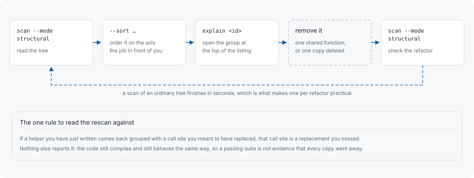

# The refactoring loop



## Ordering the report for the job in front of you

The default order is the composed priority. When the job is one particular
measure, order on it instead — `--sort duplicated-tokens` for the most repeated
code, `--sort instances` for the most widely copied, `--sort identifier-jaccard`
for the copies that still agree on their names. See
[Reading a report](reading-a-report.md#ordering).

## Reading the numbers before opening the files

The similarity breakdown a group prints under `-v` is worth reading before
opening the files. A group whose structure and control flow agree exactly while
its identifiers do not is usually the same routine written twice with different
names for the same things — the kind that collapses into one
function taking an argument for whatever differs. A group whose identifiers agree
as well is usually a copy, where one side can simply go.

This is a way of reading the numbers, not a rule the tool applies: codehelion
reports what the occurrences have in common and leaves the refactoring to you.

## Rescanning after a refactor

A scan is also a check on the refactor you have just finished. Run it again on
the tree you changed, before moving on:

```sh
codehelion scan --mode structural
```

Then read the result against one rule: if a helper you have just written comes
back grouped with a call site you meant to have replaced, that call site is a
replacement you missed. Nothing else reports it — the code still compiles and
still behaves the same way, so a passing test suite is not evidence that every
copy went away. A scan of an ordinary tree finishes in seconds, which is what
makes running one per refactor practical.

## Following your own progress

Nothing has to be set up for this. Each scan is recorded, so the totals of the
next one say what became of the previous run's highest-ranked groups, and

```sh
codehelion explain <id>
```

says whether one particular group is still in the latest run. A
[baseline](baselines.md) is for freezing a threshold in CI; tracking a refactor in
progress does not need one.

## Whether the artifact got smaller

That is a separate question. A finding names code a reader has to keep in step,
not bytes a compiler emits.

```sh
codehelion artifact analyze path/to/binary
```

measures that side, and [Limitations](limitations.md) states how wide the gap
between the two usually is — wide enough that consolidating source duplication is
worth doing for maintainability first, and for size only where the size ceiling is
an uncompressed number.
