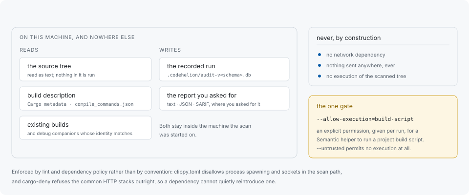

# Local execution and trust

Everything runs on the machine the scan is started on. Sources and results are
never sent anywhere, the tool has no network dependency, and it does not execute
the code it reads unless a flag permits a specific class of execution.



## What is read

The source tree as text, the build description a project already has — Cargo
metadata, a `compile_commands.json` — and, for artifact commands, existing builds
and debug companions whose identity has been verified. Nothing in that list is
loaded or run.

## What is written

The recorded run, into the local audit database under `.codehelion/`, and
whatever report was asked for, where it was asked for. Both stay on the machine.

## How the ban is enforced

By lint and dependency policy rather than by convention: `clippy.toml` disallows
process spawning and network sockets in the scan path, and `cargo-deny` refuses
the common HTTP stacks outright, so a dependency cannot quietly reintroduce one.
`make audit` runs the dependency half of that, and `make check` runs the lint
half.

## The one gate

A Semantic helper can be permitted to run a project build script, and only that,
and only when asked:

```sh
codehelion scan --mode semantic --allow-execution=build-script
```

Nothing runs without it. The flag also accepts the reserved class names
`proc-macro`, `configure`, `compiler-wrapper` and `generated-source`, which are
protocol values no helper implements yet and are rejected as unavailable rather
than as a missing installation.

This is a flag and not a configuration key for a reason that applies twice over:
the configuration file is discovered inside the tree being scanned, so a
repository would otherwise be granting permission over itself.

## Reading a repository nobody vouches for

```sh
codehelion scan --untrusted
codehelion artifact analyze path/to/binary --untrusted
```

`--untrusted` lowers every ceiling at once — file size, parse work, candidate
budgets, and for artifacts the input, time and memory ceilings — and permits no
execution at all. A configured database path must remain inside the scanned path
under it; an explicit `--db` remains a deliberate operator choice.

It is a flag rather than a configuration key for the same reason: the file that
would carry the setting is supplied by the tree whose trust level is in question.

Combined with `--mode semantic` it additionally requires an operating-system
memory ceiling around the helper process, which only Linux can enforce. Elsewhere
that combination fails rather than run a helper unconfined. The same applies to
`artifact --untrusted`, whose preset includes the memory ceiling.

`codehelion doctor` reports what the running platform can actually enforce, so
the answer for a given machine is a command rather than an assumption.

## Reporting a vulnerability

Follow [SECURITY.md](https://github.com/libraz/codehelion/blob/main/SECURITY.md)
rather than opening a public issue.
