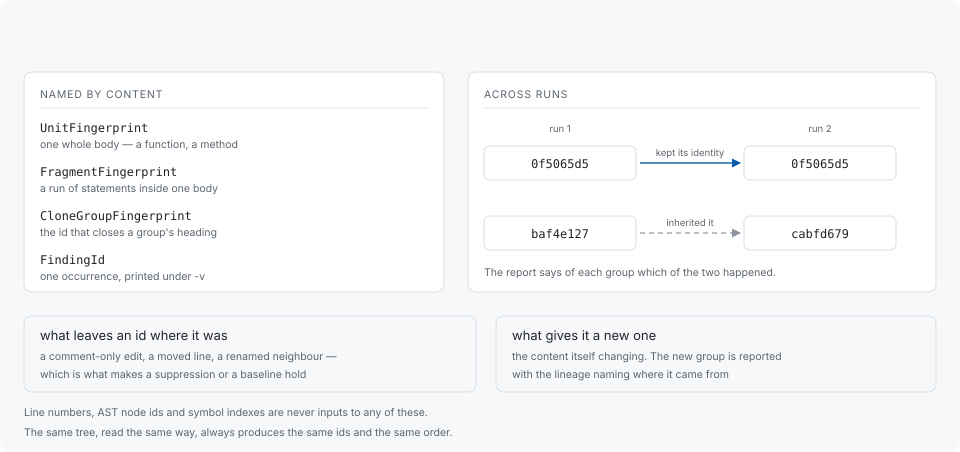

# Stable identifiers

Every finding is named by what it contains. That is what lets a decision recorded
against it — a suppression, a baseline entry, a comment in a review — survive the
edits around it.



## The four kinds

| Name | What it identifies |
|---|---|
| `UnitFingerprint` | one whole body — a function, a method |
| `FragmentFingerprint` | a run of statements inside one body |
| `CloneGroupFingerprint` | a clone group; the id that closes its heading |
| `FindingId` | one occurrence inside a group; printed under `-v` |

Line numbers, AST node ids, WASM function indexes and ELF symbol indexes are
never inputs to any of them. That is a deliberate constraint rather than an
implementation detail: an id derived from a position moves when an unrelated
edit above it moves the position, and every record kept against it goes stale
silently.

The same tree, read the same way, always produces the same ids and the same group
order.

## Group ids and occurrence ids are not interchangeable

The id in a group's heading is the **group's**. It is what
`[suppression] clone-ids` and a baseline take, because both name whole groups —
so an occurrence's id written into either matches nothing. Occurrence ids are
printed as `[finding <ID>]` under `-v`.

Either kind can be opened:

```sh
codehelion explain b92c1297
codehelion explain b92c1297 --format json
```

A prefix is accepted as long as it is unambiguous; the report prints one short
enough to type and long enough to be unique in that run, and `-vv` prints
identifiers in full.

## What moves an id, and what does not

An id is derived from normalized content, so it stands through a comment-only
edit, a reflow, a moved line, and any edit elsewhere in the file. It changes when
the content it names changes.

That matters most while duplication is being removed, because removing a
duplication also rewrites the code around it. A group that comes out of the
rearrangement carries a new id — and would read as duplication somebody added, if
nothing connected the two. Something does: when a group changes identity but
retains enough member content, its **lineage** links the two runs, and the report
says of each group whether it kept the identity it had or inherited one, and from
which group.

The totals also say what became of the previous comparable run's highest-ranked
groups. How many are followed is configurable:

```toml
# [report]
# churn-top = 100
```

## What a run's identity includes

Ids identify content; a run identifies the conditions the content was read
under. The mode, the frontend and normalization versions, the language, and the
build variant are all part of it, and reports print the build variant's digest.
Two runs read under different conditions are kept in separate spaces rather than
compared — which is why, for instance, changing how a bare `.h` is read puts the
results beside the previous ones rather than on top of them.

## Where ids are used

- [Suppression](suppression.md) — `clone-ids` hides a group by its id.
- [Baselines](baselines.md) — a baseline is a set of group ids and what they contained.
- [The command line](cli.md) — `explain` opens either kind.
