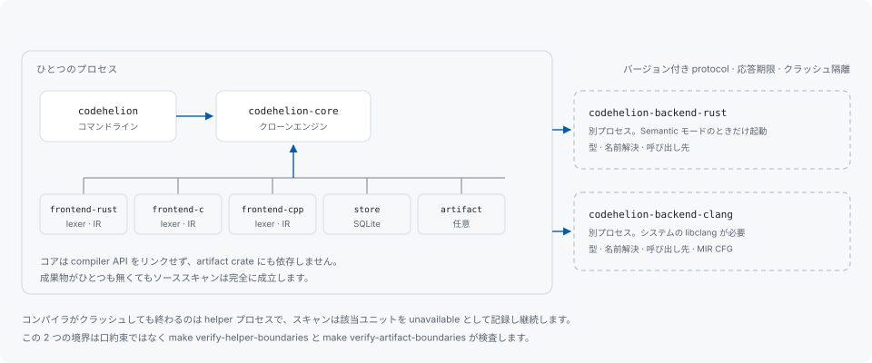

# アーキテクチャ



## crate

workspace は `codehelion-*` crate の集合で、依存方向はひとつに固定されています。CLI がコアエンジンに依存し、フロントエンド・ストア・成果物リーダーはコアと組み合わせて使うものです。

| crate | 何を持つか |
|---|---|
| `codehelion` | コマンドライン、レポートの描画、スキャンの駆動 |
| `codehelion-core` | クローンエンジン。正規化・索引・ペア生成・検証・グループ化・priority |
| `codehelion-frontend-rust` / `-c` / `-cpp` | エラー耐性のある lexer と、各言語が生成する IR |
| `codehelion-store` | ローカル SQLite のスキーマと、それに対するすべての読み書き |
| `codehelion-artifact` | コンパイル済み成果物のリーダー。フォーマットごとに feature で分離 |
| `codehelion-helper` / `-helper-protocol` | helper プログラムの探索と、helper と共有するワイヤ型 |
| `codehelion-backend-rust` / `-backend-clang` | helper バイナリそのもの |

## 口約束ではなく検査される 2 つの境界

**クローンエンジンは成果物リーダーに依存しません。** 成果物解析が任意であるというのは可能な限り強い意味でそうで、成果物がひとつも無くてもソーススキャンは完全に成立します。それを成り立たせているのは「どの関数を呼ぶか」という慣習ではなく crate グラフです。

**compiler API は CLI にリンクされません。** コンパイラ由来の情報は別プロセスから届くため、コンパイラ自身の依存・バージョン下限・クラッシュ時の挙動が、利用者の導入するバイナリの外に留まります。

どちらも文章上の約束ではありません。

```sh
make verify-artifact-boundaries
make verify-helper-boundaries
```

これらは `make check` と CI で走ります。どちらかの境界を動かせば落ちます。

## helper protocol

helper はバージョン付き protocol で通信する独立したバイナリです。やり取りでは capability — その helper が何を供給できるか、許可された場合に何を実行するか — を交渉し、応答には期限があります。helper がプロセスとして分かれているため障害も隔離されます。コンパイラがクラッシュしても終わるのは helper で、スキャンは該当ユニットを unavailable として記録して継続します。

`codehelion doctor` は、導入済みの各 helper が何を答えたかを表示します。バージョン、話す protocol、見つけたコンパイラ、供給できるもの、許可されたときに実行するものです。

protocol の handshake は `crates/codehelion-helper-conformance/` にあります。CLI 側が生成した protocol の記述に対して突き合わせるのではなく、別々にビルドした helper のバイナリを実際に通します。

## ストレージ

正規のストレージはローカル SQLite で、JSON・SARIF・CSV はエクスポート形式であり、読み戻しの経路にはしません。この向きは意図的です。レポートは記録済み実行の描画にすぎないので、形式を足してもスキャンの結論は変わらず、受け手のパーサがツール自身の状態の一部になることもありません。

スキーマにはバージョンがあります。別のバージョンで書かれたデータベースは移行しません。[設定](configuration.md#ローカルデータベース)を参照してください。

## バージョン付きスキーマ

各 IR・fingerprint・正規化規則は、normalization / frontend / mode / language / build variant を含むバージョンを持ちます。そのため異なる条件で読んだ 2 つの実行は比較されずに分けて保たれ、レポートは常にどの条件で作られたかを述べます。

## 貢献

[CONTRIBUTING.md](https://github.com/libraz/codehelion/blob/main/CONTRIBUTING.md) を参照してください。ローカルでの作業は要約すると次のとおりです。

```sh
make format        # 自動修正: clippy --fix + cargo fmt
make check         # format-check + lint + 境界検査 + test + doc
make eval          # コーパスに対する検出精度
```

`unsafe` は禁止、clippy は `pedantic` + `nursery` を警告エラー扱いで実行し、テストは対象コードと同時に書きます。
