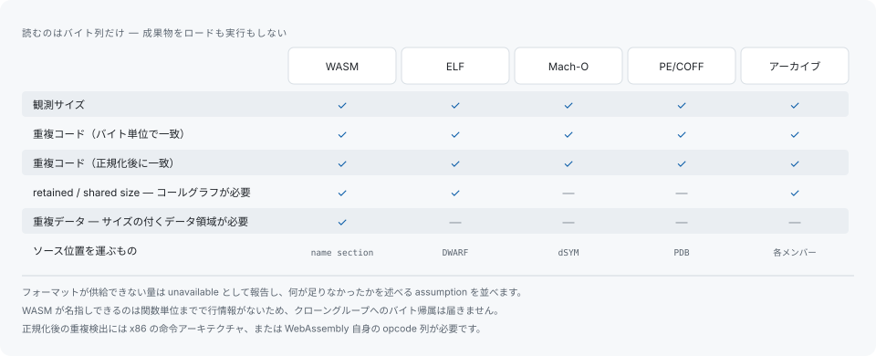

# 成果物解析

`artifact` コマンドはコンパイル済み成果物をローカルで読みます。読むのはバイト列だけで、対象の成果物をロードすることも実行することもありません。ソーススキャンはこれに一切依存しません。クローンエンジンは成果物リーダーに依存しておらず、成果物がひとつも無くてもソーススキャンは完全に成立します。

```sh
codehelion artifact analyze path/to/binary
codehelion artifact analyze path/to/binary --format csv  # json も可。既定は text
codehelion artifact report              # 最新の保存済み解析を再描画
codehelion artifact compare before/binary after/binary
```

## フォーマットごとに確立できること



観測済みサイズと重複したコードは、どのフォーマットについても報告します。それ以外は、そのフォーマット自身が確立できる量に限られます。retained size と shared size はコールグラフを必要とし、これを導けるのは WASM、ELF、静的アーカイブです。重複データは独立にサイズの付くデータ領域を必要とし、それを持つのは WASM です。ソース位置にはデバッグ情報が要ります。ELF なら DWARF、Mach-O なら identity の一致する dSYM、PE/COFF なら一致する PDB、WASM なら記録された source map の URL です。

フォーマットが供給できない量は数値を作らず unavailable として報告し、何が足りなかったかを述べる assumption を並べます。

フォーマットごとの能力表は、各バックエンドが自ら返す定義から生成されており、`crates/codehelion-artifact/FORMAT_SUPPORT.md` にあります。

### WebAssembly のソース対応はシンボル単位まで

ELF・Mach-O・PE/COFF は DWARF、identity の一致する dSYM、一致する PDB を通じてソース行に到達でき、クローングループの行範囲にバイトを帰属させられるのはこのソース行があるからです。コアモジュールが持つのは name セクションの関数名だけで行情報が無いため、対応づけは関数単位までにとどまり、クローングループの byte 帰属は unavailable になります。DWARF を出してビルドすれば行情報は得られますが、それは測っている対象そのもの — 通常はそれこそが検査の理由であるサイズ — を変えてしまいます。そのため各レポートは、別の問いに答えるビルドを要求するのではなく、name セクションで何が得られて何が得られないかを述べます。

## デバッグ情報

デバッグ情報は ELF build ID、Mach-O UUID、または PE CodeView/PDB identity が一致した場合にだけ受け入れます。identity を確かめないまま受け入れると、あるビルドのバイトを別のビルドのソースに帰属させてしまうからです。

```sh
codehelion artifact analyze path/to/binary --debug-file companion
```

これは source scan なしでも使えます。source-artifact correlation を要求する場合にだけ `--source-run` と `--build-variant` を追加してください。

## build variant

`--build-variant` に渡すのは自分で書くファイルで、どこかにある既存のファイルを探すものではありません。中身は自由に決められます。それによって得られるのは、同じ条件でビルドされた成果物どうしだけが比較される、という保証です。

```sh
echo '{"profile":"release","target":"wasm32","toolchain":"emcc-5.0.2"}' > build-variant.json
codehelion artifact analyze dist/app.wasm --build-variant build-variant.json --source-run 2
```

`--build-variant manifest.json` を渡した場合、build variant の identity には正規化した JSON 値を使うため、空白や object member の順序は identity を変えません。

source run にも build variant があり、レポートはその digest を表示します。両者は別々の条件 — ソースをどう読んだか、成果物をどうビルドしたか — であり、突き合わせるのではなく並べて記録します。manifest に書き写すべき source 側の digest は存在しません。

## 実体化の多重度

「ソース上に写しが何個あるか」と「バイナリ上に本体が何個あるか」は別の軸で、codehelion の探索モデルにあるのは前者だけです。ソース上は 1 本のテンプレートでも、呼び出し箇所ごとにクロージャ型や型引数が違えば、成果物上では十数個の別々の実体になります。ソース上の写しは 1 つなので、この多重度を述べるクローングループは存在しません。

ソーススキャンと相関させた場合は別立てで報告します。

```sh
codehelion artifact analyze path/to/binary --source-run 1 --build-variant build-variant.json
```

これは、成果物が複数の実体として出力したソース単位を、実体の個数と観測サイズとともに並べます。ここに出るバイト数は成果物が現に費やしている量であって削減量ではありません。ソース上の 1 本を統合しても実体は 1 つも減らず、この数値を下げるには実体化の回数そのものを減らすことになります。数えるのに必要なのは「マッピングが単一のソース単位を指したこと」だけなので、シンボル名さえあれば足り、デバッグ行情報は要りません。

## 2 つのビルドを比較する

```sh
codehelion artifact compare before/binary after/binary
```

は、同じフォーマットの成果物 2 つのあいだで実測したバイト差を報告します。両方の build variant manifest を渡せば、ビルド条件が違う場合に警告を出し、差がソース変更だけから来たかのように見せることはしません。さらに source run とクローングループを渡すと、calibration の計測も記録します。[calibration](calibration.md) を参照してください。

## 上限と隔離

`artifact analyze` と `artifact compare` は既定で 512 MiB を超える入力を拒否し、parse・相関・永続化・render を別プロセスの worker で行い、全体に 30 秒の期限を適用します。worker が別プロセスであるため、壊れた入力によってパーサが進まなくなっても期限は有効で、timeout の診断は停止した段階を名指しします。

- `--max-bytes` と `--timeout-seconds` が入力サイズと時間の上限を調整します。
- `--max-memory-bytes <bytes>` は Linux で worker の仮想メモリ上限を強制します。ほかの OS ではこのオプションを黙って無視せず、エラーとして返します。
- `--untrusted` はこの 3 つをまとめて締めるため Linux 限定です。ほかの OS では、強制できないメモリ上限のまま素性の分からない成果物を読む代わりにエラーで停止します。

`artifact report` と `artifact calibration` はローカルデータベースにあるものを読み直すだけで、worker を挟まずプロセス内で動くため、これらのオプションは対象外です。`artifact report` 用に保存する versioned IR には別途 64 MiB の上限があり、保存対象の詳細がこれを超える分析は partial なデータベースレコードを残さずに失敗します。

## 結果の読み方

これらのコマンドが測るのはビルドされた成果物そのものです。ソース側で重複を統合したら成果物から何が減るかを予測するものではなく、両者の隔たりは無視できません。サイズの数値をリファクタの根拠に使う前に[制限](limitations.md)を読んでください。
