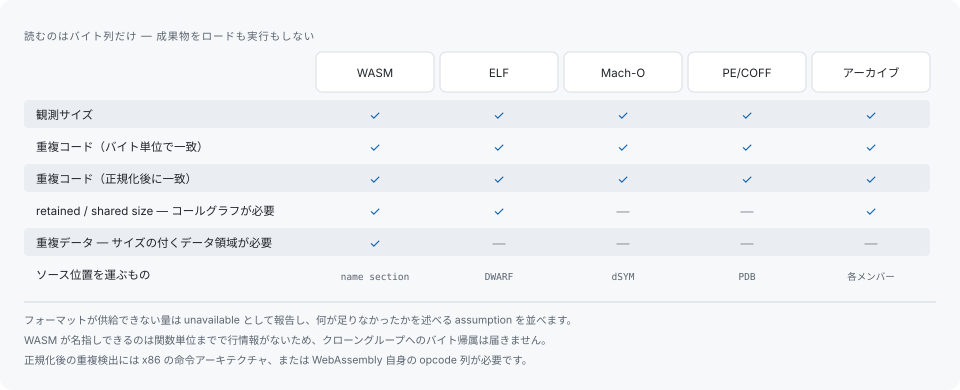

# 成果物解析

`artifact` コマンドはコンパイル済み成果物をローカルで読みます。読むのはバイト列だけで、対象の成果物をロードすることも実行することもありません。ソーススキャンはこれに一切依存しません。クローンエンジンは成果物リーダーに依存しておらず、成果物がひとつも無くてもソーススキャンは完全に成立します。

```sh
codehelion artifact analyze path/to/binary
codehelion artifact analyze path/to/binary --format csv  # json も可。既定は text
codehelion artifact report              # 最新の保存済み解析を再描画
codehelion artifact compare before/binary after/binary
```

## フォーマットごとに確立できること



観測済みサイズと重複したコードは、どのフォーマットについても報告します。それ以外は、そのフォーマット自身が確立できる量に限られます。retained size と shared size はコールグラフを必要とし、これを導けるのは WASM、ELF、静的アーカイブです。重複データは独立にサイズの付くデータ領域を必要とし、それを持つのは WASM です。ソース位置にはデバッグ情報が要ります。ELF なら DWARF、Mach-O なら identity の一致する dSYM、PE/COFF なら一致する PDB、WASM なら記録された source map の URL です。

フォーマットが供給できない量は数値を作らず unavailable として報告し、何が足りなかったかを述べる assumption を並べます。

静的アーカイブと再配置可能オブジェクトは、シンボル全体にだけ帰属させ、ソースの行範囲は持ちません。再配置可能オブジェクトには行テーブルを結びつけるロードアドレスが無いためです。メンバーをリンクしてイメージにすると、行範囲に届きます。

ELF の retained size とデッドコードの候補は、直接の呼び出しに加えて、関数の外へ出るジャンプ（末尾呼び出し）と、アドレスが取られている関数をたどります。後者は呼び出し辺が届かなくても実行されるためです。レジスタやメモリスロット経由のジャンプや呼び出しは、リーダーが名指しできない呼び出し先に届くので、それが現れる場合のデッドコード一覧は証明ではなく候補の一覧です。

フォーマットごとの能力表は、各バックエンドが自ら返す定義から生成されており、`crates/codehelion-artifact/FORMAT_SUPPORT.md` にあります。

### WebAssembly のソース対応はシンボル単位まで

ELF・Mach-O・PE/COFF は DWARF、identity の一致する dSYM、一致する PDB を通じてソース行に到達でき、クローングループの行範囲にバイトを帰属させられるのはこのソース行があるからです。コアモジュールが持つのは name セクションの関数名だけで行情報が無いため、対応づけは関数単位までにとどまり、クローングループの byte 帰属は unavailable になります。DWARF を出してビルドすれば行情報は得られますが、それは測っている対象そのもの — 通常はそれこそが検査の理由であるサイズ — を変えてしまいます。そのため各レポートは、別の問いに答えるビルドを要求するのではなく、name セクションで何が得られて何が得られないかを述べます。

## デバッグ情報

デバッグ情報は ELF build ID、Mach-O UUID、または PE CodeView/PDB identity が一致した場合にだけ受け入れます。identity を確かめないまま受け入れると、あるビルドのバイトを別のビルドのソースに帰属させてしまうからです。

```sh
codehelion artifact analyze path/to/binary --debug-file companion
```

これは source scan なしでも使えます。source-artifact correlation を要求する場合にだけ `--source-run` と `--build-variant` を追加してください。

## build variant

`--build-variant` に渡すのは自分で書くファイルで、どこかにある既存のファイルを探すものではありません。中身は自由に決められます。それによって得られるのは、同じ条件でビルドされた成果物どうしだけが比較される、という保証です。

```sh
echo '{"profile":"release","target":"wasm32","toolchain":"emcc-5.0.2"}' > build-variant.json
codehelion artifact analyze dist/app.wasm --build-variant build-variant.json --source-run 2
```

`--build-variant manifest.json` を渡した場合、build variant の identity には正規化した JSON 値を使うため、空白や object member の順序は identity を変えません。

source run にも build variant があり、JSON と SARIF のレポートはその digest を持ち、text のレポートは成果物の削減見積もりの隣にだけ表示します。両者は別々の条件 — ソースをどう読んだか、成果物をどうビルドしたか — であり、突き合わせるのではなく並べて記録します。manifest に書き写すべき source 側の digest は存在しません。

## 実体化の多重度

「ソース上に写しが何個あるか」と「バイナリ上に本体が何個あるか」は別の軸で、codehelion の探索モデルにあるのは前者だけです。ソース上は 1 本のテンプレートでも、呼び出し箇所ごとにクロージャ型や型引数が違えば、成果物上では十数個の別々の実体になります。ソース上の写しは 1 つなので、この多重度を述べるクローングループは存在しません。

ソーススキャンと相関させた場合は別立てで報告します。

```sh
codehelion artifact analyze path/to/binary --source-run 1 --build-variant build-variant.json
```

これは、成果物が複数の実体として出力したソース単位を、実体の個数と観測サイズとともに並べます。ここに出るバイト数は成果物が現に費やしている量であって削減量ではありません。ソース上の 1 本を統合しても実体は 1 つも減らず、この数値を下げるには実体化の回数そのものを減らすことになります。数えるのに必要なのは「マッピングが単一のソース単位を指したこと」だけなので、シンボル名さえあれば足り、デバッグ行情報は要りません。

## コードの所有者

> **1.0 前の面です。** 文書化もテストもされていますが、約束に値するだけの実利用を経ていないため、リリース間で変わり得ます。

`artifact analyze` は、報告するシンボルのコードバイトを所有者ごとに分け、toolchain のコードを成果物に残している非 toolchain の関数を名指しします。どちらもシンボル名だけを読むので、名前さえあればどのフォーマットでもどの言語でも使えます。holder の表示にはさらにコールグラフと retained size が必要です（[フォーマットごとに確立できること](#フォーマットごとに確立できること)を参照）。

シンボルの owner（所有者）は、定義パスの先頭要素です。Rust ならクレート、C++ ならトップレベルの名前空間、修飾のない名前なら `<global>` です。owner は次のいずれかの class に入ります。

- `toolchain` — Rust の sysroot クレート、C++ の `std` とグローバルなアロケーション演算子、C17 Annex B の関数、C17 が実装に予約している識別子、ランタイムサポート。
- `own` — `[artifact] own` に列挙した owner。[設定](configuration.md#artifact)を参照。
- `other` — 名前はあるが上のどちらでもない owner。サードパーティのクレートなど。
- `unnamed` — 名前のない関数。owner を割り当てられません。

toolchain の分類は宣言に左右されません。`own` が空のあいだ、toolchain の外にある名前付きのコードは `other` として報告され、レポートもそう述べます。

`strtof(s, 0)` を返すだけの C 関数 `parse` を emscripten の `-O1` でビルドし、`own = ["<global>"]` で解析すると次のようになります。

```
ownership: own 6768 bytes (5 symbols), toolchain 10629 bytes (35 symbols), other 0 bytes (0 symbols), unnamed 0 bytes (0 symbols)
  declared own: <global>
  reserved (toolchain, reserved): 9013 bytes, 25 symbols
  <global> (own): 6768 bytes, 5 symbols
  c-std (toolchain, c_std): 1540 bytes, 6 symbols
  runtime (toolchain, runtime): 76 bytes, 4 symbols
  outside symbols: 61 bytes
  assumption: ownership follows the defining path of each symbol name, so generic code instantiated for your types is counted under the library that defines it
toolchain holders (held bytes are part of the holder's retained size):
  parse (own) f31665862c71112cfffda8f55fc54dd2: 17307 bytes in 34 symbols, 6756 bytes in 4 symbols absorbed
    head strtof 320251c57384d307522b489a48cc4e39: 17307 bytes
  shared: 78 bytes in 5 symbols, 0 bytes in 0 symbols absorbed
    setThrew ba286dbdc84dc40e5966ae8f29485879: 38 bytes (root), called by nothing
    _initialize 4feb66b59715a8dcbf2af30ae02ec5d6: 20 bytes (root), called by nothing
    _emscripten_stack_restore ef2222560055353cb931a59336cb3e00: 10 bytes (root), called by nothing
    emscripten_stack_get_current 4eaae22504bd0bae04ab33f12aeef742: 8 bytes (root), called by nothing
    __wasm_call_ctors a0d352ddbe45c0d90cb9d358e3fa1f9d: 2 bytes (root), called by _initialize (toolchain)
  assumption: unqualified functions whose immediate dominator is toolchain code are counted as toolchain code, except main and static initializers
  assumption: toolchain holders treat every recorded function reference as a root, so code reached through a function table is reported as shared
```

`outside symbols` は実行可能セクションのサイズからシンボルのサイズの合計を引いた残りで、これを足すとセクション全体に一致します。text 出力に並ぶのはバイト数の大きい上位 10 owner までで、JSON には全件が入ります。`artifact compare` もバイト差を同じように分けます。シンボルは after 側の owner に、削除されたものは before 側の owner に帰属させ、割り振れない残りは `outside symbols` として示します。

holder は、toolchain のコードではないのに toolchain のコードを成果物に残している関数です。そのコードは holder を通してしか到達できません。toolchain の各関数は、コールグラフ上でいちばん近い非 toolchain の支配元に帰属します。holder の直下で直接入る toolchain 関数が head で、holder の行にはその下にあるものすべてのバイト数が入ります。直近の支配元が toolchain のコードである修飾なしの関数は、toolchain のコードとして数えるため、libc の補助関数が自分の呼ぶ libc を抱えているようには見えません。この分は absorbed として別に示します。`main` と静的初期化子は吸収しません。

held bytes は holder の retained size の一部です。toolchain のコードがどこから入っているか、その入口を外すと何が切り離されるかを示すもので、削減の保証ではありません。次のビルドでは同じコードに別の経路から届くこともあります。

非 toolchain の関数がひとつも支配していない toolchain のコードは shared toolchain code です。合計を出し、入口ごとにそれを直接呼ぶ関数を挙げます。成果物がエクスポートしている入口には `(root)` が付きます。shared のバイトはどの holder にも属さず、呼び出し元の間で按分もしません。holder は retained size が出ないときは出ず、レポートは数値の代わりにその旨を述べます。名前だけで所有者を決めることの限界は[制限](limitations.md#成果物検査はシンボルに依存します)にあります。

owner のラベルはレポートを描画するたびに、保存済みのシンボル名と現在の `[artifact] own` から導きます。所有者に関するものはデータベースに書き込みません。そのため `artifact report` は実行時点の設定に従い、`artifact compare` も `artifact analyze` と同じく作業ディレクトリの設定を読みます。

## 同一関数のコピー

静的リンクされたビルドの libc 関数のように、1 つの成果物の中に名前と本体が同じ関数が複数ある場合があります。各コピーは自分の fingerprint を持つので、サイズも呼び出しグラフ上の位置もコピーごとに別です。共有される内容は JSON レポートの `content_fingerprint` が示します。呼び出し元、呼び出し先、ルート、サイズ、本体のいずれでも他のコピーと区別できないコピーはファイル内の順序で見分けられ、`identity_by_order` が付きます。`artifact compare` はコピーを fingerprint ではなく内容で対応づけます。アーカイブ内のシンボルも、メンバー全体のバイト列に依存しない `content_fingerprint` を持ちます。1 つの関数を変更しても、同じメンバー内のほかの関数の比較用識別子は変わりません。

## 2 つのビルドを比較する

> **1.0 前の面です。** 文書化もテストもされていますが、約束に値するだけの実利用を経ていないため、リリース間で変わり得ます。

```sh
codehelion artifact compare before/binary after/binary
```

は、同じフォーマットの成果物 2 つのあいだで実測したバイト差を報告します。両方の build variant manifest を渡せば、ビルド条件が違う場合に警告を出し、差がソース変更だけから来たかのように見せることはしません。バイトが変わったのにサイズが変わらないネイティブのシンボルは modified として報告します。バックエンドがオペランドをデコードせず本体の identity を持たない場合は、保持しているコードのバイト列がその代わりになります。さらに source run とクローングループを渡すと、calibration の計測も記録します。[calibration](calibration.md) を参照してください。

## 上限と隔離

`artifact analyze` と `artifact compare` は既定で 512 MiB を超える入力を拒否し、parse・相関・永続化・render を別プロセスの worker で行い、全体に 30 秒の期限を適用します。worker が別プロセスであるため、壊れた入力によってパーサが進まなくなっても期限は有効で、timeout の診断は停止した段階を名指しします。

- `--max-bytes` と `--timeout-seconds` が入力サイズと時間の上限を調整します。入力の上限は、DWARF と PDB のデバッグ情報がフレームや行レコードへ展開される範囲も制限します。
- `--max-memory-bytes <bytes>` は Linux で worker の仮想メモリ上限を強制します。ほかの OS ではこのオプションを黙って無視せず、エラーとして返します。
- `--untrusted` はこの 3 つをまとめて締めるため Linux 限定です。ほかの OS では、強制できないメモリ上限のまま素性の分からない成果物を読む代わりにエラーで停止します。

`artifact report` と `artifact calibration` はローカルデータベースにあるものを読み直すだけで、worker を挟まずプロセス内で動くため、これらのオプションは対象外です。`artifact report` 用に保存する versioned IR には別途 64 MiB の上限があり、保存対象の詳細がこれを超える分析は partial なデータベースレコードを残さずに失敗します。

## 結果の読み方

これらのコマンドが測るのはビルドされた成果物そのものです。ソース側で重複を統合したら成果物から何が減るかを予測するものではなく、両者の隔たりは無視できません。サイズの数値をリファクタの根拠に使う前に[制限](limitations.md)を読んでください。
