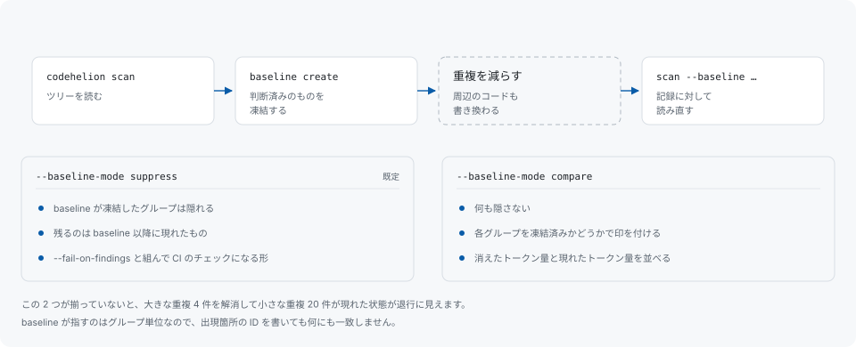

# baseline

> **1.0 前の面です。** 文書化もテストもされていますが、約束に値するだけの実利用を経ていないため、リリース間で変わり得ます。

baseline は、プロジェクトが受け入れた finding を明示的に残す記録です。コミットするファイルであり、以降のスキャンはそれを読んで「その後に現れたもの」を報告します。



## 作る

```sh
codehelion scan                       # ツリーを読む
codehelion baseline create .          # 起点を記録する
```

`baseline create` は、直前に記録されたスキャンが報告した finding を `codehelion-baseline.json` に凍結します（`--file` で別のパスを指定できます）。`baseline update` は最新のスキャンが報告しなくなった項目を落とします。重複が実際に減ったときに baseline が縮むのはこの操作です。

baseline が指すのはグループ単位なので、出現箇所の ID を書いても何にも一致しません。[安定した識別子](stable-ids.md)を参照してください。

## baseline に対して読む

```sh
codehelion scan --baseline codehelion-baseline.json
```

既定は `suppress` モードです。baseline が凍結したグループは隠れ、残るのは baseline 以降に現れたものになります。`--fail-on-findings` と組み合わせると、これが CI のチェックに向いた形になります。誰も判断していない重複が現れたときにビルドが落ちます。

```sh
codehelion scan --baseline codehelion-baseline.json --baseline-mode compare
```

`compare` は何も隠しません。各グループを「baseline が凍結したもの」と「そうでないもの」に分けて報告し、消えたトークン量と現れたトークン量を並べて出します。この 2 つが揃っていないと、大きな重複 4 件を解消して小さな重複 20 件が現れた状態が退行に見えてしまいます。また重複の解消はその周辺のコードも書き換えるため、組み替えの結果として現れるグループは新しい ID を持ちます。直前までエントリがあった場所に立っているグループは、誰かが足した重複としてではなく、そこに立っているものとして報告されます。

build variant または detector version が異なる場合は、古い baseline を引き継がず現行スキャンから作り直します。

## baseline が要らない場合

baseline は閾値を凍結して CI で守るためのものです。リファクタの進み具合を自分で追うだけなら baseline は要りません。再スキャンして、前回の実行で上位にあったグループがどうなったかを述べるサマリ行と、そのグループが最新の実行に残っているかを述べる `codehelion explain <id>` を読めば足ります。どちらもローカルのデータベースにすでにある実行から導出されるので、作るものも、同期を取り続けるものも、コミットするものもありません。

## CI で使う

```sh
codehelion scan --mode structural \
  --baseline codehelion-baseline.json \
  --fail-on-findings
```

exit code `3` は visible finding が残っていることを意味します。レポート・記録されるスナップショット・発火した上限など、実行の他の側面はこのフラグで変わらないため、同じコマンドを push 前にローカルで走らせることにも意味があります。

組み込む前に知っておくとよいことが 2 つあります。baseline はスキャンを読んだ条件に紐づくため、開発者と違う読み方をする CI ジョブ（`.h` の文法判定が違う、モードが違う）では、その開発者が作った baseline と噛み合いません。またスキャンはローカルデータベースに記録しますが、CI ではそのデータベースはランナーごと捨てられるのが普通です。失われるのは合計欄が出す実行間の比較だけで、それ以外に代償はありません。
