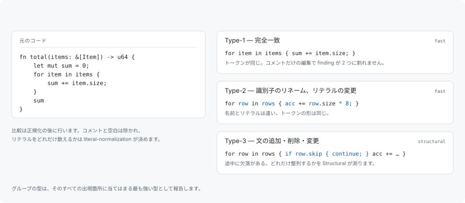

# クローンの型

グループの型は、そのすべての出現箇所に当てはまる最も強い型として報告します。型は標準的な 3 つで、いずれも正規化のあとで測ります。



## Type-1 — 完全一致

トークンが同じコピーです。比較の前にコメントと空白を除くため、整形し直しただけ・コメントを足しただけのコピーも Type-1 のままで、コメントだけの編集で 1 件の finding が 2 件に割れることもありません。

Type-1 はリンカがすでに畳んでいる可能性が最も高い型です。Type-1 の finding がサイズの主張ではなく保守性の主張であるのはそのためです。[制限](limitations.md)を参照してください。

## Type-2 — 識別子のリネーム、リテラルの変更

トークンの形は同じで、名前やリテラルの値が異なるコピーです。設定できるのはリテラルをどれだけ数えるかの一点です。

```toml
# literal-normalization = "full"    # "preserve" / "category" / "full"
```

- `preserve` — リテラルが 1 つでも違えば別のものとして扱います。
- `category` — 同じ種別のリテラルどうしは等しいとみなします。
- `full` — リテラルを完全に正規化して落とします。

既定は `full` です。定数表を数値だけ変えて 2 回書いたものは、どちらにせよ同じ保守上の問題だからです。

## Type-3 — 文の追加・削除・変更

途中に欠落があるコピーです。ガードが 1 行挿入された、ケースが 1 つ落ちた、文が書き換えられた、といったものが該当します。Fast モードはこの型に到達しません。これは調整の問題ではなく、構造パスを飛ばしたことの代償です。Structural モードは 2 つがどれだけ整列するかを測り、その結果を類似度の内訳として報告します。

成熟したツリーの重複の多くはこの型にあり、同時に型の境界が曖昧になる場所でもあります。十分にずれたコピーはもはやコピーではなく、その線引きを決める閾値については[グループ化](grouping.md)で説明します。

## 何を比較するか

比較の単位は本体全体（関数やメソッド）と、その中の文の連なりです。そのためグループは「この 2 つの本体はコピーである」か「この文の連なりがここでも繰り返されている」のいずれかを述べ、レポートは両者を区別します。

報告する最小のクローン長は行ではなくトークンで決めます。

```toml
# min-clone-tokens = 20             # 報告する最小クローン長（トークン数）
```

これより短い一致は、コードについてよりも言語の構文について述べていることになります。

## semantic な一致

Semantic モードは、コンパイラが解決した名前と型に対する登録済みのルールを加えます。トークンや形の比較では到達しない一致で、コーパスの平均ではなく各ルール専用のテストが主張を担保します。これは意味的等価性についての一般的な主張ではなく、列挙された有限のルール集合です。このビルドがいくつのルールを持ち、そのうちどれが `--compare-languages` を必要とするかは `codehelion doctor` が報告します。
