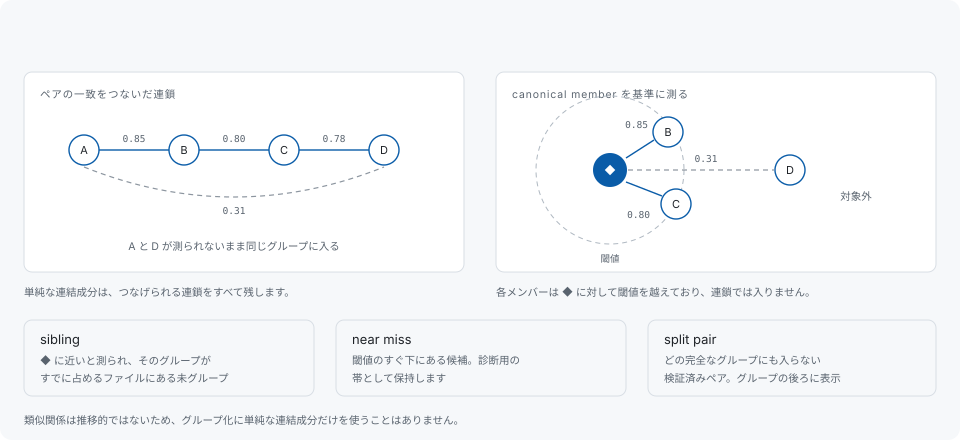

# グループ化

互いに検証を通ったペアは、まだ finding ではありません。レポートが列挙するのはグループであり、出現箇所がどうグループになるかは、レポートが読めるものになるかどうかを決める設計上の要点です。



## 連結成分ではいけない理由

類似関係は推移的ではありません。A と B が 0.85、B と C が 0.80、C と D が 0.78 で一致していても、A と D は 0.31 しかない、ということが起こります。単純な連結成分はつなげられる連鎖をすべて残すので、この 4 つが 1 つのグループになり、両端の 2 つは互いに比較されたことすらありません。そのグループを開いた読み手は無関係な 2 本のルーチンを見つけ、次のグループを信じなくなります。

codehelion は各候補を **canonical member** に対して測り、それに対して閾値を越えたものだけを入れます。これは single linkage ではなく complete linkage 相当の振る舞いです。canonical member はグループの基準になる出現箇所で、一覧では `◆` が付き、最初に報告されます。最初に読むべき 1 件です。

グループには上限もあります。`limits.max-component` が「1 つの塊として比較する関連ユニットの最大集合」を区切るため、病的に密な近傍がひとつの巨大なグループになることはありません。

## 閾値から漏れたものの行き先

疑わしいものを一切入れない閾値は、同時に証拠を捨てます。それを落とさず保持するのが次の 3 つのチャネルです。いずれもグループとは別立てで報告するため、混同されることはありません。

### split pair

検証は通ったのに、どの完全なグループにも入れられないペアです。入れてしまうと、互いに一致しない 2 つのユニットを同じグループに押し込むことになるためです。これは実在する finding なので保持します。

```toml
# split-pairs = "rank-down"   # "hide" / "rank-down" / "report"
```

既定では非表示にせず、完全なグループより後ろに表示します。

### sibling

グループに入らないまま、その近くにある未グループのユニットです。Structural と Semantic には sibling channel が 2 つあります。

- **similarity channel** は常に動きます。グループの canonical member に近いと測られ、そのグループがすでに占めているファイルの中にある未グループの unit を保持します。
- **signature channel** は `--siblings-by-signature` を指定したときだけ動き、既定では無効です。有効にすると、グループの canonical function と正規化済みシグネチャが一致し、まだグループ化されていない関数が同じディレクトリにある場合に、低信頼度の sibling として保持できます。

シグネチャが証拠になるのは、それが珍しいあいだだけです。`limits.signature-sibling-max-units-per-signature` が許す数より多くの unit が共有するシグネチャは探索から丸ごと除外され、いくつのシグネチャを除外したか、いちばん広く共有されていたものがどれだけの unit に及んだかをサマリが述べます。このチャネルが助けにならない場所については[制限](limitations.md)を参照してください。

`--show-siblings` が変えるのはテキストの可視性だけで、JSON と SARIF には常に sibling のデータが含まれます。

### near miss

主要な閾値のすぐ下に落ちた候補で、診断用の帯として保持します。帯の幅と保持数は設定できます。

```toml
# near-miss-delta = 0.05     # Type-3 の閾値直下の帯
# near-miss-cap = 1000       # report ごとに保持する near miss 数
```

`--show-near-misses` で表示します。「惜しいところで一致しなかったものはあるか」への答えであり、finding としては数えません。

## グループの周辺を読む

完全なコピーは保守負債ですが、内容がずれたコピーはその時点のバグです。そして検出しにくいのはずれたほうです。ですからグループが報告されたら、その隣にあるものを読んでください。グループに入らなかった同じ形の関数こそ、ずれたコピーがいちばん潜んでいそうな場所です。実際にそうだった実測例が[制限](limitations.md)に 2 件あります。
