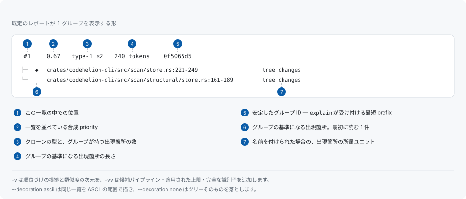

# レポートの読み方

## 1 つのグループ



見出しの先頭に来るのは順位づけの値です。一覧はこの値の順に並んでいるので、並び順をそのまま縦に読めます。`◆` はそのグループの基準になっている出現箇所、つまり最初に開くべき 1 件を指します。見出しの末尾にある識別子は `codehelion explain` が受け付ける最短の prefix なので、一覧からそのままグループを開けます。

見出しには `cabfd679 [narrower cut of baf4e127]` のように、別のグループを名指しする注記が付くことがあります。これは、より長い重複の短い切り口にあたる重複です。何も隠さないために報告しますが、順序の中に自分の位置は持ちません。

## 合計欄が述べること

```text
1,511 groups (type-1 86, type-2 196, type-3 1229) · 335 suppressed · sorted by priority
supplemental: 517 siblings (--show-siblings; 7,332 dropped by search ceilings), 1,000 near misses (--show-near-misses; 5,199 dropped by the retention cap)
396 files, 190,744 lines, 1,001,215 tokens · run 1 (replay: codehelion report --run 1)
```

1 行目はレポートそのものです。グループが何件で、どの型が何件で、抑制ルールで何件隠したかを示します。2 行目は、実行が見つけたものの一覧には昇格させなかったもの、つまり sibling と near miss です。どの上限が何件落としたかを別々に数えるので、どの上限を動かすべきかが読み取れます。3 行目は何を読んだかと、それを再現する run id です。

## seam

[seam](seam-tracking.md) とは、同じ意味論が複数の場所に実装されているパスの集合です。計測済みの seam があるとき、レポートはそれが何を要したかを述べます。

```text
seams: frontend-c-cpp 12 asymmetric changes, 7 breaches (last 6e014d86), 1,553 findings
       readme-en-ja 1 asymmetric change, 1 breach (last 634aa5c9)
       artifact-fixture-scripts 3 asymmetric changes, 1 breach (last 6f5d63c3)
since seam run 2: frontend-c-cpp +1,553 findings
```

非対称変更と breach は `codehelion seam` が計測した値であり、ここで測り直したものではなく読み戻したものです。レポートはコミットを 1 件も開きません。`findings` はもう一方の側の値で、seam の内側に位置する重複の finding の件数です。数える対象は、その seam run を記録した時点で同じツリーについて最も新しく完了していたスキャンです。背後にスキャンの無い seam は finding の件数を持ちません。

`since` の行は動いたものだけを名指しします。2 回の評価が同じ値であれば `since` の行そのものが出ません。差分を出すのは、同じ設定ダイジェストの下にある前回の実行が同じ seam を持っていた場合だけです。その後に台帳へ書き加えられた seam には前の世代が無く、何も無いものから引けば、台帳が伸びたことをコードが動いたこととして報告してしまいます。

件数 0 は、その不在こそが答えである箇所にだけ `no breaches`、`no asymmetric changes` と語で書きます。何度も跨がれながら一度も breach していない seam は、跨ぐたびに修正を要する seam と区別するために台帳がある、まさにその事例だからです。

この区画が出るのは、そのツリーについて `codehelion seam` の実行が記録されているときだけです。区画の無いレポートは、seam に費用が掛かっていない台帳ではなく、誰も評価していない台帳です。`codehelion scan` の全モードと `codehelion report` の text と JSON に入り、どちらの場合も SARIF には入りません。SARIF は finding のための形式であり、seam の要約は finding ではないからです。

## 注記と警告

実行を限定する情報はレポートではなく標準エラー出力に回ります。これにより標準出力はパイプに流せる状態を保ちます。

```text
⚠ warning: candidate search was truncated by crowded bucket, overshared postings, overshared values; duplication the tree contains may be missing from this report
```

探索の上限に達した実行はその旨を述べ、どの上限が発火したかを名指しします。部分的な答えを完全な答えとして提示することはありません。

## より詳しく: `-v`

`-v` は各グループの順位づけの根拠を追加します。実行中のモードでは測れなかった類似度の次元も含みます。

```text
 #1  0.67  type-1 ×2  240 tokens  0f5065d5
     across directories, identifiers 1.00
     confidence 0.86, maintenance risk 0.44, refactoring difficulty 0.19 (2 instances, 240-240 tokens, 240 repeated, 1.00 similarity, 2 file(s))
     similarity: composite 1.00 (lexical 1.00, structural 1.00, control-flow 1.00, type n/a, api 1.00); cohesion 1.00; confidence high [structural-verify-v1]
     content entropy: 4.91 bits
     body evidence: loop no, recognised allocation no, at least 26 call site(s)
     ├─ ◆ crates/codehelion-cli/src/scan/store.rs:221-249  tree_changes  [finding c8c5aae7]
     └─   crates/codehelion-cli/src/scan/structural/store.rs:161-189  tree_changes  [finding 63fd17f8]
```

- **similarity** は lexical / structural / control-flow / type / API の次元ごとに報告し、そこから導いた composite を添えます。そのモードで測れなかった次元は `n/a` であり、代わりの数値を置くことはありません。
- **confidence・maintenance risk・refactoring difficulty** は独立した 3 つの指標で、そのあとに導出の根拠となった事実が続きます。設定できるのは 3 つをどう重み付けするかだけで、重複が何を要求するかはコード側の性質です。
- **content entropy** は、本物のルーチンと、同じ数トークンの退化した繰り返しとを分けます。
- **body evidence** は本体に何が観測されたかで、boilerplate の分類はここから議論されます。
- **`[finding <id>]`** は各出現箇所自身の安定 ID で、グループの ID とは別のものです。

## 実行そのものの記録: `-vv`

`-vv` は候補パイプラインを段階ごとに、各段階が何をなぜ落としたかとともに追加します。

```text
candidate pipeline:
  structural files        396
  units                   10764
  indexed fragments       52997  (dropped: overshared values 8, overshared postings 4421)
  exact seed pairs        389113
  near-match pairs        5286  (dropped: too few shingles 6883, crowded bucket 1, length ratio 11473, estimated jaccard 114710)
  near-match near misses  1000  (dropped: retention cap 5199)
  sibling entries         518  (dropped: sibling candidate budget 7165, sibling per group cap 167)
  control-flow pairs      14481  (dropped: skeleton too small 9132, length ratio 2770)
  unit pairs              144581  (dropped: nested 1217, divergent shapes 54171, below min clone tokens 33)
  verified pairs          4881  (dropped: no group holds both 599, a group says it already 28)
  components              653
  grouped units           10635  (dropped: left alone 129)
```

スキャンの報告が期待より少ないときに見るのがこの表です。件数が崩れる段階が、引き上げるべき上限を名指しします。`-vv` は識別子も prefix ではなく完全な形で表示します。

## 並べ替え

レポートは既定で合成された priority 順に並びます。priority は複数の指標を重み付けして束ねた値なので、目の前の作業がそのうちのひとつの指標そのものである場合は、その軸で直接並べ替えられます。

```sh
codehelion scan --sort duplicated-tokens    # 繰り返されているトークン量が多い順
codehelion scan --sort instances            # 複製された箇所が多い順
codehelion scan --mode structural --sort identifier-jaccard # 識別子の一致度が高い順
```

保守性を目的とする場合は、`--sort identifier-jaccard` に下限を付けるのが当たりを引きやすい方法です。識別子がまだ一致している複製は、まだ誰も分岐させていない複製であり、共通関数ひとつで置き換えられる余地が残っています。

```sh
codehelion scan --mode structural --sort identifier-jaccard --min-identifier-jaccard 0.7
```

この下限は同じ検出結果に対する見え方の指定です。テキスト表示の対象を決めるだけで、集計値・エクスポート・記録内容のいずれも変えません。識別子の一致度はユニット全体に対して測るため、fragment を報告する実行では比較する値がなく、その分を「表示しなかった件数」として明示します。

## どれだけ表示するか

省略した場合、text レポートはグループ 10 件と各グループの出現箇所 5 件までを列挙し、いくつ省いたかを述べます。`--limit <n>` が変えるのはグループ数だけで、両方の上限を外すのは `--limit 0` です。`--quiet` は見出し・seam の区画・要約・注記を省き、グループだけを出力します。

`--show-suppressed`、`--show-siblings`、`--show-near-misses` は text の一覧を展開します。変えるのはテキストの可視性だけで、JSON と SARIF にはフラグに関係なくこれらのデータが含まれます。

## グリフと色

`--decoration ascii` は同じ一覧を ASCII の範囲だけで描き、`--decoration none` はツリーそのものを落とします。後者は人ではなく別のプログラムが読む場合のための形です。色と違って出力先には従いません。ファイルに書き出したレポートも端末と同じツリーを保ちます。エスケープシーケンスと違い、罫線素片はファイルの中でも読めるからです。`auto` は Windows を除いて罫線素片を使います。Windows のコンソールはアクティブなコードページ次第で描画が変わるためです。

`--color <auto|always|never>` は端末判定を上書きし、`NO_COLOR` にも従います。

## 他の形式

```sh
codehelion scan --format json --output report.json
codehelion scan --format sarif --output report.sarif   # SARIF 2.1.0 ログ
```

JSON はバージョン付きスキーマを持ち、SARIF は静的解析結果の受け手向けです。どちらも記録済みの実行からのエクスポートで、`codehelion report` が描くのも同じものです。そのため、あとからスキャンし直さずに別形式のレポートを作れます。
