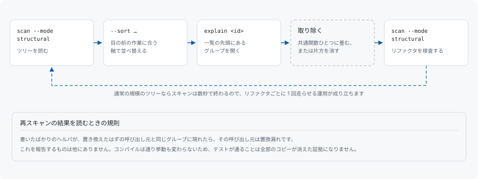

# リファクタのループ



## 目の前の作業に合わせて並べ替える

既定の順序は合成された priority です。作業がある 1 つの指標そのものである場合は、その軸で並べ替えてください。繰り返されているトークン量なら `--sort duplicated-tokens`、複製された箇所の多さなら `--sort instances`、名前がまだ一致しているコピーなら `--sort identifier-jaccard` です。[レポートの読み方](reading-a-report.md#並べ替え)を参照してください。

## ファイルを開く前に数値を読む

`-v` でグループの下に出る類似度の内訳は、ファイルを開く前に読む価値があります。構造と制御フローが完全に一致していて識別子だけが一致しないグループは、同じ処理を別々の名前で 2 回書いたものであることが多く、違う部分を引数に取る 1 つの関数に畳めます。識別子まで一致するグループはコピーであることが多く、片方をそのまま消せます。

これは数値の読み方であって、ツールが適用する規則ではありません。codehelion は各出現が何を共有しているかを報告するだけで、リファクタの判断は利用者に委ねます。

## リファクタ直後の再スキャン

スキャンは、終えたばかりのリファクタに対する検査でもあります。次の作業へ移る前に、書き換えたツリーをもう一度読ませてください。

```sh
codehelion scan --mode structural
```

読み方は規則ひとつです。書いたばかりのヘルパが、置き換えたはずの呼び出し元と同じグループに現れたら、その呼び出し元は置換漏れです。これを報告するものは他にありません。コンパイルは通り、挙動も変わらないため、テストが通ることはすべてのコピーが消えた証拠になりません。通常の規模のツリーならスキャンは数秒で終わるので、リファクタごとに 1 回走らせる運用が現実的に成り立ちます。

## 自分の進み具合を追う

そのための準備は要りません。各スキャンは記録されるので、次のスキャンの合計欄が前回の実行で上位にあったグループがどうなったかを述べ、

```sh
codehelion explain <id>
```

が特定のグループが最新の実行に残っているかを述べます。[baseline](baselines.md) は CI で閾値を凍結するためのもので、進行中のリファクタを追うだけなら要りません。

## 成果物も小さくなったか

これは別の問いです。finding が名指しするのは読み手が同期を取り続ける必要のあるコードであり、コンパイラが出力するバイト数ではありません。

```sh
codehelion artifact analyze path/to/binary
```

がそちらを測ります。両者の隔たりがどれほど大きいかは[制限](limitations.md)にあります。ソース側の重複の統合は、まず保守性のために行う価値があり、サイズのために行う価値があるのはサイズの上限が非圧縮の値である場合だけです。
