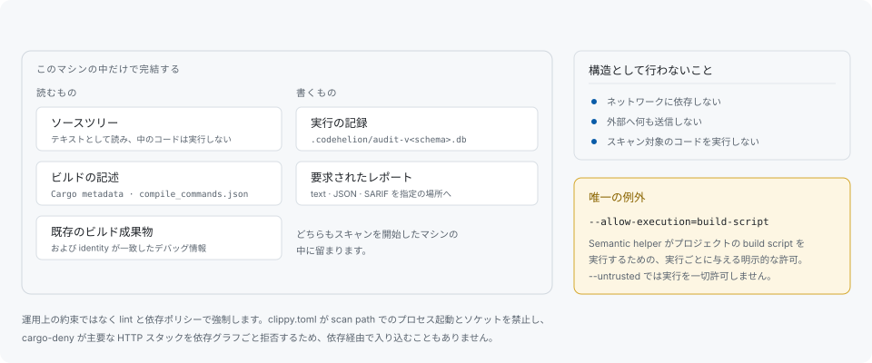

# ローカル実行と信頼

処理はすべて、スキャンを開始したマシンの中で完結します。ソースコードも解析結果も外部に送信せず、ネットワークへの依存を持たず、実行分類ごとの許可フラグを渡さないかぎり読み取ったコードを実行しません。



## 読むもの

ソースツリーをテキストとして、プロジェクトがすでに持っているビルドの記述（Cargo metadata、`compile_commands.json`）を、そして `artifact` コマンドでは既存のビルド成果物と identity を検証したデバッグ情報を読みます。このいずれもロードも実行もしません。

## 書くもの

実行の記録を `.codehelion/` 配下のローカル監査データベースへ、そして要求されたレポートを指定された場所へ書きます。どちらもマシンの中に留まります。

## 禁止をどう強制しているか

運用上の約束ではなく lint と依存ポリシーで強制しています。`clippy.toml` が scan path でのプロセス起動とネットワークソケットを禁止し、`cargo-deny` が主要な HTTP スタックを依存グラフごと拒否するため、依存経由で入り込むこともありません。依存側の検査は `make audit` が、lint 側は `make check` が走らせます。

## 唯一の例外

Semantic helper には、プロジェクトの build script を実行する許可を、それだけ、要求されたときにだけ与えられます。

```sh
codehelion scan --mode semantic --allow-execution=build-script
```

これが無ければ何も実行されません。このフラグは `proc-macro`・`configure`・`compiler-wrapper`・`generated-source` という予約済みの分類名も受け付けますが、これらはまだどの helper も実装していない protocol の値で、「導入されていない」ではなく「利用できない」として拒否されます。

設定キーではなくフラグである理由は二重に効いています。設定ファイルはスキャン対象のツリーの中から見つかるものなので、設定キーにするとリポジトリが自分自身に対する許可を出すことになります。

## 素性の分からないリポジトリを読む

```sh
codehelion scan --untrusted
codehelion artifact analyze path/to/binary --untrusted
```

`--untrusted` はすべての上限をまとめて下げ（ファイルサイズ・parse 作業量・候補 budget、成果物では入力・時間・メモリの上限）、実行を一切許可しません。この下では設定されたデータベースのパスはスキャン対象パスの内側に留まる必要があります。明示的な `--db` は運用者の意図的な選択として扱います。

設定キーではなくフラグである理由も同じです。その設定を載せるファイルは、信頼度が問われている当のツリーが供給するものだからです。

`--mode semantic` と併用する場合は、helper プロセスに OS が強制するメモリ上限を追加で要求します。これを課せるのは Linux だけで、ほかの OS では helper を無防備に走らせる代わりにエラーで停止します。メモリ上限をプリセットに含む `artifact --untrusted` も同様です。

`codehelion doctor` は、動作中のプラットフォームが実際に何を強制できるかを報告します。特定のマシンについての答えは、仮定ではなくコマンドで得られます。

## 脆弱性の報告

公開 issue ではなく [SECURITY.md](https://github.com/libraz/codehelion/blob/main/SECURITY.md) の手順に従ってください。
