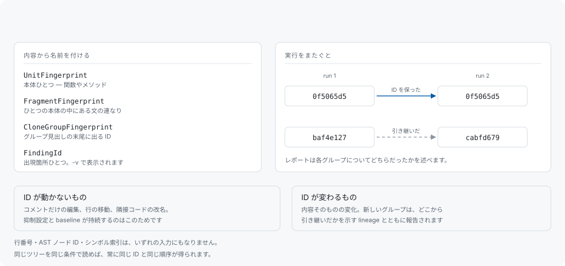

# 安定した識別子

すべての finding は、それが含む内容によって名前を持ちます。抑制設定・baseline の項目・レビューのコメントなど、その finding に記録した判断が周辺の編集を越えて残るのはそのためです。



## 4 種類

| 名前 | 何を指すか |
|---|---|
| `UnitFingerprint` | 本体ひとつ — 関数やメソッド |
| `FragmentFingerprint` | ひとつの本体の中にある文の連なり |
| `CloneGroupFingerprint` | クローングループ。見出しの末尾に出る ID |
| `FindingId` | グループ内の出現箇所ひとつ。`-v` で表示 |

行番号・AST ノード ID・WASM の function index・ELF の symbol index は、いずれの入力にもなりません。これは実装の都合ではなく意図的な制約です。位置から導いた ID は、上のほうの無関係な編集で位置が動くと一緒に動き、その ID に紐づけた記録が黙って無効になるからです。

同じツリーを同じ条件で読めば、常に同じ ID と同じグループ順序が得られます。

## グループの ID と出現箇所の ID は別もの

グループの見出しに出るのは**グループの** ID です。`[suppression] clone-ids` と baseline が受け取るのもこちらで、どちらもグループ単位で指定するものなので、出現箇所の ID を書いても何にも一致しません。出現箇所の ID は `-v` を付けたときに `[finding <ID>]` として表示されます。

どちらの ID も開けます。

```sh
codehelion explain b92c1297
codehelion explain b92c1297 --format json
```

一意に定まるかぎり prefix でも受け付けます。レポートが表示するのは、打ちやすく、かつその実行の中で一意になる長さのもので、`-vv` では完全な識別子を表示します。

## ID が動くとき、動かないとき

ID は正規化済みの内容から導くため、コメントだけの編集・整形の変更・行の移動・ファイル内の他の場所の編集では変わりません。変わるのは、その ID が指す内容そのものが変わったときです。

これが最も効いてくるのは重複を減らしている最中です。重複の解消はその周辺のコードも書き換えるため、組み替えの結果として現れるグループは新しい ID を持ちます。両者を結ぶものが何も無ければ、それは誰かが足した重複のように見えてしまいます。結ぶものはあります。グループの identity が変わっても十分な member content を共有していれば、保存された **lineage** が 2 つの実行を結び、レポートは各グループについて identity をそのまま保ったのか、どのグループから引き継いだのかを述べます。

合計欄も、比較対象となった直前の実行で上位にあったグループがその後どうなったかを述べます。追跡する件数は設定できます。

```toml
# [report]
# churn-top = 100
```

## 実行の identity に含まれるもの

ID が指すのは内容で、実行が指すのはその内容を読んだ条件です。モード、frontend と normalization のバージョン、言語、build variant がすべて含まれ、レポートは build variant の digest を表示します。異なる条件で読んだ 2 つの実行は比較せず別の空間に置きます。たとえば裸の `.h` をどちらの文法で読むかを変えると、結果は以前のものに重ならず、その隣に置かれます。

## ID が使われる場所

- [抑制](suppression.md) — `clone-ids` が ID でグループを隠します。
- [baseline](baselines.md) — baseline はグループ ID とその内容の集合です。
- [コマンドライン](cli.md) — `explain` はどちらの種類も開きます。
